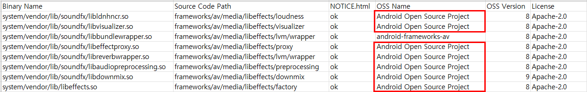

# FOSSLight Android Scanner

  <a href="https://github.com/fosslight/fosslight_android_scanner"></a> [](https://api.reuse.software/info/github.com/fosslight/fosslight_android_scanner)

[**FOSSLight Android Scanner**](https://github.com/fosslight/fosslight_android_scanner)는 Android 모델에 탑재되는 Binary를 식별하고, 각 Binary 별로 Open Source 사용 여부를 확인하며, License에 따라 요구되는 고지 사항을 OSS 고지문(ex. NOTICE.html)에 적절히 포함되었는지를 검증하기 위해 수행합니다.  


## 필요 조건
{: .left-bar-title} 
- [**FOSSLight Android Scanner**](https://github.com/fosslight/fosslight_android_scanner)는 Python 3.10+ 기반에서 동작합니다.    
- OSS 정보(OSS Name, OSS Version, License)를 Binary DB로부터 추출하는 기능을 사용하려면 [DB 세팅 가이드](etc/binary_db.md)를 참고하세요. 
- Android 모델을 build clean 상태에서 build하여 산출물(/out directory) 및 build log(android.log)를 확보합니다.  
    ```
    (Android native source build 예)
    $ source ./build/envsetup.sh
    $ make clean
    $ lunch aosp_hammerhead-user
    $ make -j4 2>&1 | tee android.log
    ```  

    {::options parse_block_html="true" /}
    <details>
    <summary markdown="span">Android 7.0 이전 version의 모델</summary>

    Android 7.0 이전 version의 모델일 경우, 먼저 module-info.mk 파일을 build/core/tasks/하위에 위치시킨 후 build합니다. (build시 module-info.json 파일을 생성하게 하기 위함)

    ```
    $ wget https://raw.githubusercontent.com/aosp-mirror/platform_build/android-cts-7.0_r33/core/tasks/module-info.mk
    $ mv ./module-info.mk ./build/core/tasks
    ```

    </details>  
<br><br>

## 설치 방법
{: .left-bar-title} 
1. [python 3.10 + virtualenv](../scanner/etc/guide_virtualenv.md) 환경 세팅
2. Python package인 fosslight_android 설치
    ```
    $ pip3 install fosslight_android
    ```
<br><br>

## 실행 방법
{: .left-bar-title} 
build 산출물 (/out directory) 및 build log file (android.log) 가 android source path 에 존재해야 합니다.  

```
(venv)$ fosslight_android  -s <android_source_path> -a <build_log_file>
```

- Options
```
    📖 Usage
    ────────────────────────────────────────────────────────────────────
    fosslight_android [options] <arguments>

    📝 Description
    ────────────────────────────────────────────────────────────────────
    FOSSLight Android Scanner lists all the binaries loaded on the
    Android-based model to check which open source is used for each
    binary, and to check whether the notices are included in the OSS
    notice (ex. NOTICE.html: OSS Notice for Android-based model).

    📚 Guide: https://fosslight.org/fosslight-guide-en/android

    ⚙️  General Options
    ────────────────────────────────────────────────────────────────────
    -h                     Show this help message
    -v                     Show version information

    🔍 Scanner-Specific Options
    ────────────────────────────────────────────────────────────────────
    -s <path>              Path to the Android source (default: current directory)
    -a <build_log_file>    Build log file name (the file must be located in the
                           Android source path)
    -m                     Analyze source code for paths where the license
                           could not be found
    -e <path1> <path2>     Paths to exclude from source analysis
                           ⚠️  IMPORTANT: Always wrap in quotes to avoid shell expansion
                           Example: fosslight_android -e "test/" "vendor/sample/"
    -p <path>              Check files that should not be included in the
                           packaging file (uses pkgConfig.json for filtering rules)
    -f                     Print result of find command for binaries that cannot
                           find a source code path
    -i                     Disable automatic OSS name conversion based on AOSP
    -r <result.txt>        result.txt file with a list of binaries to remove

    💡 Examples
    ────────────────────────────────────────────────────────────────────
    # Scan current directory with build log
    fosslight_android -s /path/to/android -a android_build.log

    # Scan with source analysis for unlicensed binaries
    fosslight_android -s /path/to/android -a build.log -m

    # Scan with exclusions
    fosslight_android -s /path/to/android -a build.log -e "test/" "vendor/sample/"

    # Check packaging files
    fosslight_android -p /path/to/packaging/root
``` 
<br><br>    

## 결과
{: .left-bar-title} 

```
$ tree
.
├── fosslight_report_android_260406_1340.xlsx   
├── fosslight_log_android_260406_1340.txt   
├── notice_to_fosslight_hub_260406_1340.zip      
└── REMOVED_BIN_BY_DUPLICATION_260406_1340.txt
```

- fosslight_report_android_[datetime].xlsx : FOSSLight Report 형태의 Android 분석 결과 (Binary별 checksum, tlsh 값은 report에 기본적으로 숨김 처리 되어 있음)    
- fosslight_log_android_[datetime].txt : 실행 log
- notice_to_fosslight_hub_[datetime].zip : notice file이 2개 이상인 경우 .zip으로 압축됨
   - notice_to_fosslight_hub_[datetime].{extension} : notice file이 1개인 경우(ex. NOTICE.html) 
- REMOVED_BIN_BY_DUPLICATION_[datetime].txt : output path에 동일한 binary name과 checksum으로 인해 FOSSLight Report에서 중복 제거된 파일 목록을 기록하며, -r 옵션 사용 시 추가 제거 항목도 포함됩니다.


| Column           | 내용                                                                                            |
|:-----------------|:----------------------------------------------------------------------------------------------|
| Binary Name      | out directory 내 존재하는 Binary 목록 (binary, library, APK, font 등 )                                |  
| Source Code Path | Binary를 구성하는 Source Code의 Path 정보                                                |  
| Notice           | NOTICE 파일에 Binary 정보가 표시되었는지 여부를 표시합니다. Open Source가 사용된 Binary라면, ok여야 합니다.<br>&ensp;&ensp;- ok : Source Path에 NOTICE 파일이 있고, 최종 output NOTICE (ex. NOTICE.html)에 Binary 포함<br>&ensp;&ensp;- ok(NA) :  Source Path에 NOTICE 파일이 없으나, 최종 output NOTICE (ex. NOTICE.html)에 Binary 포함<br>&ensp;&ensp;- nok :  Source Path에 NOTICE 파일이 없고, 최종 output NOTICE (ex. NOTICE.html)에 Binary가 포함되어 있지 않음<br>&ensp;&ensp;- nok(NA) :  Source Path에 NOTICE 파일이 있음에도, 최종 output NOTICE (ex. NOTICE.html)에 Binary가 포함되어 있지 않음      |
| OSS Name         | Binary DB에서 매칭하는 Binary의 정보를 가져와서 보여줍니다.     |
| OSS Version      | Binary DB에서 매칭하는 Binary의 정보를 가져와서 보여줍니다.                               |
| License          | 하기 정보로 부터 추출한 Open Source License 를 보여줍니다.<br>&ensp;&ensp;- Binary DB에서 매칭되는 Binary의 정보<br>&ensp;&ensp;- Source Code Path 내 "MODULE_LICENSE_xxxxxx"와 같이 License를 명시한 file을 읽어서 표시<br>&ensp;&ensp;- output의 {MODULE_NAME}.meta_lic에서 찾은 정보    |
| Need Check       | 'O'인 경우, 검토가 필요합니다.                                                                           |
| Comment          | 검토가 필요한 사항을 출력합니다.<br>&ensp;&ensp;- Fill in [Column명] : 기입이 필요한 Column을 표시.<br>&ensp;&ensp;ex) Fill in OSS Name : 'OSS Name' Column에 사용한 OSS의 이름을 기입해야 함.<br>&ensp;&ensp;- Add NOTICE to path : Source Code Path에 NOTICE 파일이 없으므로, NOTICE 파일을 해당 binary의 Source Code Path에 추가해야함.<br>&ensp;&ensp;단, NOTICE 파일을 Source code path에 추가하기 어렵거나 NOTICE파일을 추가해도 최종 target에 탑재되는 NOTICE에 포함되지 않는 경우 FOSSLight Hub를 통해 Project를 리뷰 받은 후 Supplement NOTICE.html 기능을 통해 추가되어야하는 NOTICE를 다운로드 받은 후 Android 모델 OSS 고지문 > '별도 생성한 NOTICE를 OSS 고지문에 추가' 방법을 통해 보완이 필요합니다.|
| (TLSH)           | Binary의 TLSH 값을 출력합니다.                                                            |
| (SHA1)           | Binary의 Checksum 값을 출력합니다.                                                            |

<br><br>

## 추가 기능
{: .left-bar-title} 

### -p 옵션 : Packaging 대상 제외 대상 확인 
{: .specific-title}
공개할 Source Code 취합시, 포함되지 말아야 하는 파일 이름, 확장자, 디렉토리를 체크합니다.  
#### 사전 준비
{: .under-bar-title}
1. Packaging Config File : 체크할 항목을 json 형식의 pkgConfig.json 파일 이름으로 생성합니다.
Example : pkgConfig.json

```
    {
       "Prohibited_File_Names":[
          "key_file",
          "confidential_key"
       ],
       "Prohibited_File_Extensions":[
          "exe",
          "jar"
       ],
       "Prohibited_Path":[
          "confidential",
          ".git"
       ]
    }
```

2. 항목 별 설명 : 항목 별 작성할 사항이 1개 이상인 경우 "," 로 구분하여 작성합니다.
    - Prohibited_File_Names : 검출하려는 파일 이름 
    - Prohibited_File_Extensions : 검출하려는 파일 확장자 
    - Prohibited_Path : 검출할 파일 디렉토리

3. 공개할 소스 코드를 취합한 디렉토리 위치 혹은 압축 파일 확인
    - 공개할 소스 코드 취합한 디렉토리나 압축 파일 내 압축된 파일이 있을 경우, 압축을 해제하여 검색합니다.
    - 압축 해제 지원 확장자 : tar, tar.gz, zip
        - tar, tar.gz, zip 외의 압축 파일이 있다면, 압축 해제를 미리 수동으로 해야합니다.
    
#### 실행방법  
{: .under-bar-title}
1. Packaging Config File을 pkgConfig.json 파일명(json 형식)으로 준비합니다.
2. -p 옵션을 추가하여 실행합니다. (-p : 공개할 소스 코드를 취합한 Path 혹은 압축 파일)
    ```
    (venv)$ fosslight_android -p [A path or compressed file containing the source code to be disclosed]
     
    ex
    (venv)$ fosslight_android -p /home/test/sourceCodeToBeDisclosed.tar.gz
    ```   

#### 결과 확인 
{: .under-bar-title}
1. 검출된 항목별로 추출된 목록을 보여줍니다.
2. 결과 example :       

    ```
        (venv)$ fosslight_android  -p /home/test/sourceCodeToBeDisclosed.tar.gz
        1. Prohibited file names : 1
        sourceCode/executable/LgeOscClient/confidential_key
        2. Prohibited file extension : 4
        sourceCode/executable/Report_Jenkins_ubuntu.exe
        sourceCode/executable/ReportTool_v3.03_181128U.jar
        sourceCode/executable/Protex_Create_Upload_Analyze_v3.03_181128U.jar
        sourceCode/executable/ReportTool_CLI_v3.03_181128U.jar
        3. Prohibited Path : 2
        sourceCode/.git
        sourceCode/executable/LgeOscClient/confidential
        4. Fail to read : 0
    ```
   
    - Prohibited file names : 공개할 소스 코드 중 파일명에 pkgConfig.json의 Prohibited_File_Names 값을 포함하는 경우 출력합니다.
    - Prohibited file extension : 공개할 소스 코드 중 파일 확장자가 pkgConfig.json의 Prohibited_File_Extensions 값인 경우 출력합니다.
    - Prohibited Path : 공개할 소스 코드 중 파일 Path 중 pkgConfig.json의 Prohibited_Path 값을 포함하는 경우 출력합니다.
    - Fail to read : 압축 해제에 실패한 파일 목록을 출력합니다.
<br><br>

### -f 옵션 : Source Code Path 미확인 Binary에 대한 Find Command 실행 결과
{: .specific-title}
Source Code Path를 찾지 못한 Binary에 대해, Android의 Source Path 내 각 폴더별로 Find Command 실행 결과를 출력합니다. 이때 out 디렉터리 및 .으로 시작하는 숨김 디렉터리는 제외됩니다.    

#### 실행방법
{: .under-bar-title}
1. -f 옵션을 추가하여 실행합니다.
    ```commandline
    (venv)$ fosslight_android  -s [android source path] -a [build log file name] -f
     
    ex
    (venv)$ fosslight_android  -s /home/soim/android/source -a android.log -f
    ```

#### 결과 확인 
{: .under-bar-title}       
1. Source Code Path를 찾지 못하는 Binary별 Find Command 실행 결과는 'FIND_RESULT_OF_BINARIES_[datetime].txt' 파일로 생성됩니다.
2. 단, Source Code Path를 찾지 못하는 Binary가 없을 경우 해당 파일은 생성되지 않습니다.
<br><br>


### -i 옵션 : OSS Name 자동 완성 기능 비활성화
{: .specific-title}
 FOSSLight Android는 OSS 정보 미확인 또는 OSS Name이 Android Open Source Project인 경우, [Android Native](https://android.googlesource.com/platform) 저장소에 해당하면 OSS Name을 자동 출력하며, 해당 기능을 끄려면 본 옵션을 선택합니다.  

#### 실행방법
{: .under-bar-title} 
1. -i 옵션을 추가하여 실행합니다.
    ```commandline
    (venv)$ fosslight_android -s [android source path] -a [build log file name] -i
 
    ex
    (venv)$ fosslight_android -s /home/soim/android/source -a android.log -i
    ```

#### 결과 확인
{: .under-bar-title}         
1. i 옵션을 사용한 분석 결과 
   {: .styled-image}
2. i 옵션을 사용하지 않은 분석 결과 
   {: .styled-image} 
<br><br>

### -r 옵션 : 특정 Binary에 대한 FOSSLight Report 중복 제거 처리
{: .specific-title}
하나의 Model에 탑재하는 Android native와 vendor가 분리된 output으로 생성되는 경우에 한하여 활용합니다. vendor에 대한 FOSSLight Android 실행시 -r 옵션을 이용하여 Android native에도 포함되는 binary를 중복 제거합니다.
    - 중복 제거 조건 : Binary name이 같고 checksum이 같거나, Binary name이 같고 TLSH 값 차이가 120이하인 경우
    - 중복 제거된 binary는 REMOVED_BIN_BY_DUPLICATION.txt에 출력됩니다.  

#### 실행방법
{: .under-bar-title} 
1. FOSSLight Android 분석 실행시 -r 옵션을 추가합니다.
    ```commandline
    (venv)$ fosslight_android -s [vendor_source_path] -a [android_build_log_file] -r [android_native_result.txt]
 
    ex
    (venv)$ fosslight_android -s [vendor_source_path] -a android.log -r android_native_result.txt
    ```

#### 결과 확인 
{: .under-bar-title}        
1. android_native_result.txt와 중복된 binary는 fosslight_report_android_[datetime].xlsx에서 제거되고, REMOVED_BIN_BY_DUPLICATION_[datetime].txt에 출력됩니다.
<br><br>

### -m 옵션 : 소스 코드 분석을 통한 License 출력
{: .specific-title}
License 정보를 못 찾은 경우에 한하여 FOSSLight Source Scanner를 이용하여 Source code를 분석한 결과를 License란에 출력합니다.        

#### 실행방법
{: .under-bar-title} 
1. -m 옵션을 추가합니다.
    ```commandline
    (venv)$ fosslight_android -s [vendor_source_path] -a [android_build_log_file] -m
     
    ex
    (venv)$ fosslight_android -s [vendor_source_path] -a android.log -m
    ```

#### 결과 확인 
{: .under-bar-title}         
1. FOSSLight Report의 License column에 분석한 결과가 채워집니다.              
2. 추가로 source_analyzed_[datetime] 폴더에 소스 코드별 분석한 결과가 생성됩니다.       
