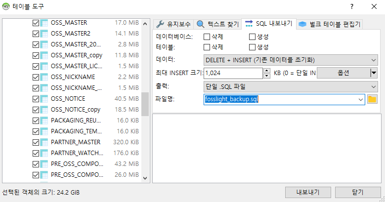

# Maintenance
```note
FOSSLight Hub를 운영하는 데 유용한 가이드입니다.
```

## DB 백업 및 복구하기
### 1. 백업
#### 선택1. 전체 백업    
mysqldump -u[아이디] -p[패스워드] [데이터베이스명] > [백업파일명].sql
```
$ mysqldump -ufosslight -pfosslight fosslight > fosslight_backup.sql
```

#### 선택2. FOSSLight 최신 버전으로 업데이트를 위한 DB 백업 (Data만 추출)
1. DBMS를 다운로드 받습니다. (권장 DBMS : HeidiSQL https://github.com/HeidiSQL/HeidiSQL)
2. DB에 접속 후 '데이터베이스를 SQL로 내보내기'를 클릭합니다.
3. DELETE + INSERT로 데이터를 추출합니다. 
    

### 2. 복구
mysql -u[아이디] -p[패스워드] [데이터베이스명] < [백업파일명].sql
```
$ mysql -ufosslight -pfosslight fosslight < fosslight_backup.sql
```

## NVD Data를 2002년 Data부터 다운로드 받기
FOSSLight Hub는 일 1회 NVD(NATIONAL VULNERABILITY DATABASE) 에서 제공되는 NVD Data Feeds(https://nvd.nist.gov/vuln/data-feeds)를 다운로드하여 Database에 저장하며 저장된 NVD Data는 [Vulnerability List](../started/2_try/7_vulnerability.md)에서 조회할 수 있습니다.      
이 때, 2002년 Data부터 NVD Data를 다운로드 받을 경우 하기와 같이 세팅합니다.     
(최초 1회만 세팅하면 이후 Data는 누적되므로 추가적으로 세팅할 필요가 없습니다.)   
    
        
**DB에서 설정값 변경**    
```
UPDATE T2_CODE_DTL SET CD_DTL_NM = 'Y' WHERE CD_NO = '990' AND CD_DTL_NO = '100';
```
NVD Data Feed initialize flag Code의 Default 값은 "N" 으로 설정되어 있으며, 위와 같이 직접 "Y"로 변경하면 다음 NVD 스케줄 동작 시 모든 NVD Data를 Clean하고 2002년 Data 파일 부터 순차적으로 등록 처리함니다.    
해당 값은 NVD Data 초기화 수행 시 에러 여부와 상관 없이 Default 값 ("N") 으로 변경됩니다.
