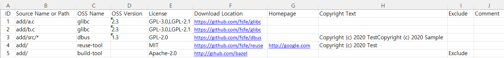

# FOSSLight Prechecker

  <a href="https://github.com/fosslight/fosslight_prechecker"></a> [](https://api.reuse.software/info/github.com/fosslight/fosslight_prechecker)

[**FOSSLight Prechecker**](https://github.com/fosslight/fosslight_prechecker)는 [소스 코드의 저작권 및 License 표기 규칙][rule]에 맞게 적용되었는지 확인하고, 필요한 경우 이를 보완하기 위해 사용하는 도구입니다.  


[rule]: https://opensource.lge.com/guide/19    


## 설치 방법
{: .left-bar-title} 

FOSSLight Prechecker는 pip3를 이용하여 설치할 수 있습니다.
[python 3.10 + virtualenv](../scanner/etc/guide_virtualenv.md) 환경에서 설치할 것을 권장합니다.
```
$ pip3 install fosslight_prechecker
```
<br><br>

## 실행 방법
{: .left-bar-title}

FOSSLight Prechecker는 다음의 네 가지 모드를 제공하며, 각 모드는 소스 코드의 저작권 및 라이선스 관리를 위한 서로 다른 기능을 수행합니다.  
1. `lint` --- [Source Code 내 저작권 및 License 표기 규칙][rule]을 준수하고 있는지 점검합니다.     
2. `convert` --- [sbom-info.yaml](https://github.com/fosslight/fosslight_prechecker/blob/main/tests/convert/sbom-info.yaml) 또는 [oss-pkg-info.yaml](https://github.com/fosslight/fosslight_prechecker/blob/main/tests/convert/oss-pkg-info.yaml)을 [Fosslight_Report.xlsx](https://fosslight.org/hub-guide/learn/2_fosslight_report.html) 형식으로 변환합니다.
     - yaml 파일의 내용을 Fosslight_Report.xlsx의 SRC Sheet로 변환됩니다.  
3. `add` --- Copyright 및 License 정보가 없는 파일에 Copyright, License, 그리고 Download Location 정보를 추가합니다.  
4. `download` --- sbom-info.yaml 파일에 명시된 각 License의 원문을 개별 파일로 다운로드 합니다.  

``` 
$ fosslight_prechecker [Mode] [option1] <arg1> [option2] <arg2>...
```

### Mode별 실행 방법 및 Parameters
{: .specific-title}
* Required parameter : **Modes**   
* Optional parameter : **Options**

```
 Usage
    ────────────────────────────────────────────────────────────────────
    fosslight_prechecker [modes] [options] <arguments>

    📝 Description
    ────────────────────────────────────────────────────────────────────
    FOSSLight Prechecker checks and corrects copyright and license writing
    rules in source code. It can lint, add, convert, and
    download license information.

    📚 Guide: https://fosslight.org/fosslight-guide/scanner/1_prechecker.html

    🔧 Modes
    ────────────────────────────────────────────────────────────────────
    lint (default)         Check copyright and license writing rules compliance
    add                    Add missing license, copyright, and download location
    convert                Convert sbom-info.yaml to FOSSLight-Report.xlsx
    download               Download license text specified in sbom-info.yaml

    ⚙️  General Options
    ────────────────────────────────────────────────────────────────────
    -p <path>              Path to check (default: current directory)
    -o <file>              Output file name
    -f <format>            Result format (yaml, xml, html)
    -e <pattern>           Exclude paths from checking (files and directories)
                           (only works with 'lint' mode)
                           ⚠️  IMPORTANT: Always wrap in quotes to avoid shell expansion
                           Example: fosslight_prechecker -e "test/" "*.pyc"
    -h                     Show this help message
    -v                     Show version information
    -i                     Don't write log file and show progress bar
    --notice               Print the open source license notice text

    🔍 Mode-Specific Options
    ────────────────────────────────────────────────────────────────────
    lint mode:
      -n                   Don't exclude venv*, node_modules, .*/, and
                           FOSSLight Scanner results from analysis

    add mode:
      -l <license>         Add license name in SPDX format (ex: "Apache-2.0")
      -c <copyright>       Add copyright text (ex: "2015-2021 LG Electronics Inc.")
      -u <url>             Add download location URL(ex: "https://www.sampleurl.com")

    download mode:
      -l <license>         License to be representative license

    💡 Examples
    ────────────────────────────────────────────────────────────────────
    # Lint current directory (check compliance)
    fosslight_prechecker lint

    # Lint specific path with exclusions
    fosslight_prechecker lint -p /path/to/source -e "test/" "node_modules/"

    # Add license and copyright to a file
    fosslight_prechecker add -p test.py -l "GPL-3.0-only" -c "2019-2021 LG Electronics Inc."

    # Add license, copyright, and download location
    fosslight_prechecker add -p src/main.py -l "Apache-2.0" -c "2023 MyCompany" -u "https://github.com/user/repo"

    # Convert sbom-info.yaml to Excel report
    fosslight_prechecker convert -p sbom-info.yaml

    # Download license text
    fosslight_prechecker download -l "MIT"
```
- -e 옵션 관련 [Pattern 매칭 가이드](https://scancode-toolkit.readthedocs.io/en/stable/reference/scancode-cli/cli-pre-scan-options.html#glob-pattern-matching)
   - ⚠️ 사용 시 반드시 쌍 따옴표("")를 이용하여 입력하시기 바랍니다.
       - 예시) fosslight_prechecker -e "dev/" "tests/"
   - ⚠️ 입력 시 파일명과 확장자는 대소문자를 정확히 구분해야 합니다. <br>

- **(Windows인 경우)** 실행 파일을 이용한 방법  
  - [FOSSLight Prechecker - Release](https://github.com/fosslight/fosslight_prechecker/releases) 에서 fosslight_prechecker_windows.exe를 다운로드  
  - 두 가지 실행 방법
    - 1) 실행 파일을 원하는 path로 이동 후 더블 클릭하여 실행  
      - Default 모드인 Lint mode만 실행  
    - 2) command로 실행     
      -  'cmd' 실행    
      -  파일이 위치한 Path에서 'Mode별 실행 방법 및 Parameters'와 같이 실행  
         ex) fosslight_prechecker lint -p src/
    
<br><br>    

## lint mode
{: .left-bar-title}
- 결과 파일
  ```
  $ tree
  .
  ├── fosslight_lint_260423_1630.yaml
  └── fosslight_log_pre_260423_1630.txt

  ```

### 1. 특정 경로분석 예시
{: .specific-title}

```
(venv)$ fosslight_prechecker lint -p /home/tests -o result.yaml
```
- 실행 결과
    <pre>
       Checking copyright/license writing rules:
          Compliant: Not-OK
          Summary:
            Open Source Package File:
            - convert/sbom-info.yaml
            - add/oss-pkg-info.yaml
            - convert/oss-pkg-info.yaml
            - lint/sub1/sbom-info.yaml
            - lint/sub2/oss-pkg-info.yaml
            Detected Licenses:
            - Apache-2.0
            - GPL-3.0-only
            - MIT
            Files without license / total: 3 / 16
            Files without copyright / total: 3 / 16
          Files without license and copyright:
          - lint/fosslight_lint_260424_1022.yaml
          - lint/fosslight_log_pre_260424_1022.txt
          Files without license:
          - lint/sub1/source_missing_lic.py
          Files without copyright:
          - lint/sub2/source_missing_cop.py
          Tool Info:
            OS: Linux 5.15.0-138-generic
            Analyze path: tests
            Python version: 3
            fosslight_prechecker version: fosslight_prechecker v4.0.8
    </pre>

### 2. 특정 파일 분석 예시
{: .specific-title}  
```
(venv)$ fosslight_prechecker lint -p "src/file1.py,src/file2.py"
```
- 실행 결과
    <pre>
        [FOSSLIGHT_PRECHECKER] Tool Info : fosslight_prechecker v4.0.8
        [FOSSLIGHT_PRECHECKER] # src/fosslight_prechecker/cli.py
        [FOSSLIGHT_PRECHECKER] * License: GPL-3.0-only
        [FOSSLIGHT_PRECHECKER] * Copyright: Copyright (c) 2021 LG Electronics Inc.
        Copyright to add(used in only 'add' mode)", type=str, dest='copyright', default="")

        [FOSSLIGHT_PRECHECKER] # src/fosslight_prechecker/_result.py
        [FOSSLIGHT_PRECHECKER] * License: GPL-3.0-only
        [FOSSLIGHT_PRECHECKER] * Copyright: Copyright (c) 2022 LG Electronics Inc.
        Copyright and License Writing Rules in Source Code. : " + RULE_LINK

        Checking copyright/license writing rules:
          Compliant: OK
          Summary:
            Open Source Package File: N/A
            Detected Licenses: N/A
            Files without license / total: 0 / 2
            Files without copyright / total: 0 / 2
          Files without license and copyright: N/A
          Files without license: N/A
          Files without copyright: N/A
          Tool Info:
            OS: Linux 5.15.0-138-generic
            Analyze path:
            - src/fosslight_prechecker/cli.py
            - src/fosslight_prechecker/_result.py
            Python version: 3
            fosslight_prechecker version: fosslight_prechecker v4.0.8
    </pre>
<ul>
 <li>
 <details>
   <summary><strong>결과 출력 항목</strong></summary>

   <p>포맷에 따라 결과로 출력되는 항목이 다를 수 있습니다.
   (Default 포맷 : yaml)</p>

   <ul>
     <li><b>Compliant</b>: lint 결과가 Compliant한지 여부 (OK or Not OK)</li>
     <li><b>Files without copyright</b>:
       Copyright가 없는 파일 리스트</li>
     <li><b>Files without license</b>:
       License가 없는 파일 리스트</li>
     <li><b>Files without license and copyright</b>:
       Copyright와 License 모두 없는 파일 리스트</li>

     <li>
       <b>Summary</b>
       <ul>
         <li><b>Detected Licenses</b>: 검출된 License</li>
         <li><b>Files without copyright / total</b>:
             Copyright 없는 파일 수 / 전체 파일 수</li>
         <li><b>Files without license / total</b>:
             License 없는 파일 수 / 전체 파일 수</li>
         <li><b>Files without copyright / total</b>:
             Copyright 없는 파일 수 / 전체 파일 수</li>
         <li><b>Open Source Package File</b>:
             sbom-info*.yaml 또는 oss-pkg-info*.yaml 파일 리스트</li>

         <li>
           <b>Tool Info</b>
           <ul>
             <li><b>Analysis path</b>: 분석 진행한 path</li>
             <li><b>OS</b>: FOSSLight Prechecker가 실행된 OS 버전</li>
             <li><b>Python version</b>:
                 FOSSLight Prechecker가 실행된 Python 버전</li>
             <li><b>fosslight_prechecker version</b>:
                 FOSSLight Prechecker 버전</li>
           </ul>
         </li>
       </ul>
     </li>

     <li>
       <details>
         <summary><strong>파일 개수 산정 시, 제외 항목</strong></summary>
         <ul>
           <li>숨김 파일 및 숨김 디렉터리 내 파일</li>
           <li>바이너리 파일</li>
           <li>특정 확장자 파일 (jar, png, exe, so, a, dll, jpeg, jpg, ttf, lib, ttc, pfb, pfm, otf, afm, dfont, json)</li>
           <li>venv, node_modules 디렉터리 내 파일</li>
           <li>.gitignore에 정의된 파일</li>
           <li>git repo 기준 untracked 파일</li>
           <li>사용자 지정 제외 경로 (-e 옵션)</li>
           <li>
             sbom-info.yaml 또는 oss-pkg-info.yaml 내에
             exclude가 True인 path
           </li>
         </ul>
       </details>
     </li>
   </ul>
 </details>
 </li>
</ul>

<br><br>

## add mode
{: .left-bar-title} 
파일 내에 기존 저작권 정보 또는 라이선스 정보가 없는 경우, 각 항목에 대해 해당 정보가 새로 추가됩니다.  

### 1. 특정 경로 내 파일에 저작권과 라이선스 추가
{: .specific-title}

```
(venv)$ fosslight_prechecker add -p tests/add -c "2025-2026 LG Electronics Inc." -l "GPL-3.0-only" -u "https://www.testurl.com"
```
<ul>
 <li>
 <details markdown="1">
 <summary markdown="span">결과</summary>

  ```bash
  [FOSSLIGHT_PRECHECKER] 
  # File list that have both license and copyright : 2 / 5
  # test_both_have_1.py
  * License: GPL-3.0-only
  * Copyright: SPDX-FileCopyrightText: Copyright 2019-2021 LG Electronics Inc.

  # test_both_have_2.py
  * License: GPL-3.0-only
  * Copyright: SPDX-FileCopyrightText: Copyright (c) 2011 LG Electronics Inc.

  # Missing license File(s)
    * oss-pkg-info.yaml
    * test_no_license.py
    * Your input license : GPL-3.0-only
  Successfully changed header of tests/add/oss-pkg-info.yaml
  Successfully changed header of tests/add/test_no_license.py

  # Missing Copyright File(s) 
    * test_no_copyright.py
    * Your input Copyright : Copyright 2025-2026 LG Electronics Inc.
  Successfully changed header of tests/add/test_no_copyright.py

  # Adding Download Location into your files
    * Your input DownloadLocation : https://www.testurl.com
  Successfully changed header of tests/add/test_both_have_1.py
  Successfully changed header of tests/add/test_both_have_2.py
  Successfully changed header of tests/add/test_no_copyright.py
  Successfully changed header of tests/add/oss-pkg-info.yaml
  Successfully changed header of tests/add/test_no_license.py
  OS: Linux 5.15.0-138-generic
  Path to analyze: tests/add
  Python version: 3
  Tool Info: fosslight_prechecker v4.0.8
  ```

 </details>
 </li>
</ul>

### 2. 특정 파일에 저작권과 라이선스 추가
{: .specific-title} 

```
(venv)$ fosslight_prechecker add -p "tests/add/test_both_have_1.py,tests/add/test_both_have_2.py,tests/add/test_no_copyright.py,tests/add/test_no_license.py" -c "2025-2026 LG Electronics Inc." -l "GPL-3.0-only" -u "https://www.testurl.com"
```
<ul>
 <li>
 <details markdown="1">
 <summary markdown="span">결과</summary>

  ```python
  # SPDX-FileCopyrightText: Copyright 2025-2026 LG Electronics Inc.
  #
  # SPDX-License-Identifier: GPL-3.0-only
  #
  # SPDX-PackageDownloadLocation: https://www.testurl.com

  import os
  from fosslight_util.set_log import init_log

  ```

 </details>
 </li>
</ul>

<br><br>

## convert mode
{: .left-bar-title} 
- 결과 파일 
  ```
  $ tree
  ├── fosslight_report_pre_260424_1010.xlsx
  └── fosslight_log_pre_260424_1010.txt
  ```

### YAML 형식 OSS 정보를 Fosslight Report로 변환  
{: .specific-title}  
- 지정된 경로(Path)에 존재하는 sbom-info.yaml 또는 oss-pkg-info.yaml 파일을 분석하여 Fosslight_Report.xlsx 형식의 Excel 보고서로 변환합니다.  
- YAML 파일이 여러 개일 경우, 각 파일은 별도의 개별 시트로 변환됩니다.  
```
$ fosslight_prechecker convert -p tests/
```
<ul>
<li>결과
<ul>
<li>
<details markdown="1">
<summary markdown="span">oss-pkg-info.yaml 파일</summary>

yaml 파일 내 경로 작성 시, 특수 문자({, }, [, ], &, *, #, ?, |, -, <, >, =, !, %, @)로 시작하는 경우 쌍따옴표("")를 사용하여 작성해주시기 바랍니다.

```yaml
glibc:
- version: '2.3'
  source name or path:
  - tests/b.c
  - tests/a.c
  license:
  - GPL-3.0
  - LGPL-2.1
  download location: https://github.com/fsfe/glibc
dbus:
- version: '1.3'
  source name or path:
  - tests/src/*
  license:
  - GPL-2.0
  download location: https://github.com/fsfe/dbus
  copyright text: 'Copyright (c) 2020 Test Copyright (c) 2020 Sample'
reuse-tool:
- version: ''
  source name or path:
  - tests/
  license:
  - MIT
  download location: https://github.com/fsfe/reuse
  homepage: http://google.com
  copyright text: Copyright (c) 2020 Test
build-tool:
- version: ''
  source name or path:
  - tests/
  license:
  - Apache-2.0
  download location: http://gihub.com/bazel
  exclude: true
```

</details>
</li>
<li>
<details markdown="1">
<summary markdown="span">fosslight_report.xlsx 파일</summary>



</details>
</li>
</ul>
</li>
</ul>

<br><br>


## download mode
{: .left-bar-title} 
1. **sbom-info.yaml 내 기입된 라이선스를 Text 파일로 Download 예시**
```
(venv)$ fosslight_prechecker download -p tests/
```
 - 결과
 ```bash
  Successfully downloaded tests/LICENSES/GPL-3.0-only.txt.
  Successfully downloaded tests/LICENSES/MIT.txt.
  Successfully downloaded tests/LICENSES/LGPL-2.1-only.txt.
  Successfully downloaded tests/LICENSES/GPL-2.0-only.txt.
 ``` 

2. **대표 라이선스 파일 생성 예시**
```
(venv)$ fosslight_prechecker download -p tests/ -l "Apache-2.0"
```
- 결과
```bash
 Successfully downloaded tests/temp_lic/LICENSES/Apache-2.0.txt.
 # Created Representative License File (tests/temp_lic/LICENSES/Apache-2.0.txt -> LICENSE)
```

  