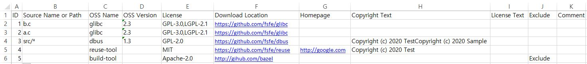
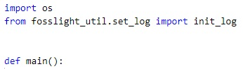
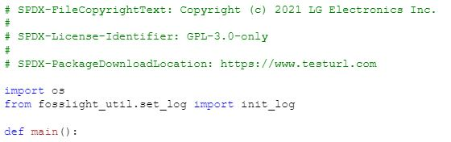

# FOSSLight Prechecker

   [](https://api.reuse.software/info/github.com/fosslight/fosslight_prechecker)

[**FOSSLight Prechecker**](https://github.com/fosslight/fosslight_prechecker)는 [reuse-tool][ret]을 이용하여 [소스 코드의 저작권 및 License 표기 규칙][rule]을 준수하는지 확인하고 보완하기 위해 사용할 수 있는 도구입니다.

[ret]: https://github.com/fsfe/reuse-tool
[rule]: https://opensource.lge.com/guide/19    

**Github Repository** : [https://github.com/fosslight/fosslight_prechecker](https://github.com/fosslight/fosslight_prechecker)     
**License** : [GPL-3.0-only](https://github.com/fosslight/fosslight_prechecker/blob/main/LICENSE)

## 목차
  - [필요 조건](#-필요-조건)
  - [설치 방법](#-설치-방법)
  - [실행 방법](#-실행-방법)
  - [결과](#-결과)
  - [동작 방식](#-동작-방식)


## 🎉 설치 방법
FOSSLight Prechecker는 pip3를 이용하여 설치할 수 있습니다.
[python 3.10 + virtualenv](etc/guide_virtualenv.md) 환경에서 설치할 것을 권장합니다.
```
$ pip3 install fosslight_prechecker
```

## 🚀 실행 방법
FOSSLight Prechecker 다음 세가지 모드를 가지고 있습니다.
1. `lint` --- [Source Code 내 저작권 및 License 표기 규칙][rule]을 준수하는지 체크합니다.    
2. `convert` --- [sbom-info.yaml](https://github.com/fosslight/fosslight_prechecker/blob/main/tests/convert/sbom-info.yaml) 또는 [oss-pkg-info.yaml](https://github.com/fosslight/fosslight_prechecker/blob/main/tests/convert/oss-pkg-info.yaml)을 [fosslight_report.xlsx](https://github.com/fosslight/fosslight-guide/blob/master/learn/2_fosslight_report.md)로 변환합니다.
     - yaml 파일을 fosslight_report.xlsx의 SRC Sheet로 변환
3. `add` --- Copyright와 License가 없는 파일에 Copyright, License, 그리고 Download Location을 추가합니다.
4. `download` --- sbom-info.yaml 파일에 작성된 License의 원문을 각각의 파일로 다운로드 합니다.

``` 
$ fosslight_prechecker [Mode] [option1] <arg1> [option2] <arg2>...
```

### Mode별 실행 방법 및 Parameters
* Required parameter : **Mode**   
* Optional parameter : **Options**

```
Mode
    lint                  (Default) 저작권 및 License 표기 규칙 준수 확인
    convert               sbom-info.yaml or oss-pkg-info.yaml -> fosslight_report.xlsx로 변환
    add                   소스 코드에 Copyright와 License 추가
    download		  sbom-info.yaml or oss-pkg-info.yaml 파일에 작성된 License의 원문을 파일로 다운로드
 
Options:
    -h                    설명 메시지 출력
    -v                    FOSSLight Prechecker 버전 출력
    -p <path>             체크할 소스 경로
    -e <path>             분석시 제외할 경로('lint' mode에서만 동작, Pattern 매칭 가능)
                           * IMPORTANT: Always wrap patterns in quotes("") to avoid shell expansion.
                             Example) fosslight_prechecker -e "dev/" "tests/
    -f <format>           결과 파일 포맷 (yaml, xml, html)
    -o <file_name>        결과 파일 이름 지정
    -n                    venv, node_modules, ./ 에 대하여 분석 제외하지 않으려면 추가
    -i                    log 파일 미생성 및 Progress bar 제거
 
Options for only 'add' mode
    -l <license>          추가할 라이선스 (SPDX License Identifer)
    -c <copyright>        추가할 저작권 (ex, <year> <copyright holder>)
    -u <dl_location>	  추가할 Download Location(ex, https://www.testurl.com)

Option for 'download' mode
    -l <license>	  대표 라이선스 파일로 생성할 라이선스 (SPDX License Identifer)
```
- -e 옵션 관련 [Pattern 매칭 가이드](https://scancode-toolkit.readthedocs.io/en/stable/cli-reference/scan-options-pre.html?highlight=ignore#glob-pattern-matching)
   - ⚠️ 사용 시 반드시 쌍 따옴표("")를 이용하여 입력하시기 바랍니다.
       - 예시) fosslight_prechecker -e "dev/" "tests/
   - ⚠️ 입력 시 파일명과 확장자는 대소문자를 정확히 구분해야 합니다.


**(Windows인 경우)** 실행 파일을 이용한 방법  
1. [FOSSLight Prechecker - Release](https://github.com/fosslight/fosslight_prechecker/releases) 에서 fosslight_prechecker_windows.exe를 다운로드  
2. 두 가지 실행 방법        
2-1. 실행 파일을 원하는 path로 이동 후 더블 클릭하여 실행
    * Default 모드인 Lint mode만 실행
2-2. command로 실행
    * 'cmd' 실행
    * 파일이 위치한 Path에서 'Mode별 실행 방법 및 Parameters'와 같이 실행
        * ex) fosslight_prechecker lint -p src/
    
    
## 📁 결과
### 🔖 lint mode

**1) 특정 경로분석 예시**  
```
(venv)$ fosslight_prechecker lint -p /home/tests -o result.yaml
```
- 실행 결과
    <pre>
       Checking copyright/license writing rules:
          Compliant: Not OK
          Files without copyright:
          - add/test_no_copyright.py
          Files without license:
          - add/test_no_license.py
          Files without license and copyright: N/A
          Summary:
            Detected Licenses:
            - '-'
            - GPL-3.0-only
            - MIT
            Files without copyright / total: 1 / 14
            Files without license / total: 1 / 14
            Open Source Package File:
            - convert/oss-pkg-info.yaml
            - add/oss-pkg-info.yaml
          Tool Info:
            Analyze path: tests
            OS: Linux 4.15.0-144-generic
            Python version: 3
            fosslight_prechecker version: fosslight_prechecker v2.2.0  </pre>

**2) 특정 파일 분석 예시**
```
(venv)$ fosslight_prechecker lint -p "src/file1.py,src/file2.py"
```
- 실행 결과
    <pre>
        # src/file1.py
        * License: 
        * Copyright: 

        # src/file2.py
        * License: GPL-3.0-only
        * Copyright: Copyright (c) 2022 LG Electronics Inc.

        Checking copyright/license writing rules:
          Compliant: Not OK
          Files without copyright: N/A
          Files without license: N/A
          Files without license and copyright:
          - src/fosslight_prechecker/_precheck.py
          Summary:
            Detected Licenses: N/A
            Files without copyright / total: 1 / 2
            Files without license / total: 1 / 2
            Open Source Package File: []
          Tool Info:
            Analyze path: /home/jaekwonbang/tests
            OS: Linux 4.15.0-144-generic
            Python version: 3
            fosslight_prechecker version: fosslight_prechecker v2.2.0  </pre>

<!--{::options parse_block_html="true" /}-->
<details>
<summary markdown="span" style="font-weight:bold">결과 출력 항목</summary>
포맷에 따라 결과로 출력되는 항목이 다를 수 있습니다.(Default 포맷 : yaml)

 - **Compliant**: lint 결과가 Compliant한지 여부 (OK or Not OK)
 - **Files without copyright**: Copyright가 없는 파일 리스트
 - **Files without license**: License가 없는 파일 리스트
 - **Files without license and copyright**: Copyright와 License 모두 없는 파일 리스트
 - **Summary**
	 - **Detected Licenses**: 검출된 License
	 - **Files without copyright / total:** Copyright 없는 파일 수 / 전체 파일 수
	 - **Files without license / total**: License 없는 파일 수 / 전체 파일 수
	 - **Files without copyright / total**: Copyright 없는 파일 수 / 전체 파일 수
	 - **Open Source Package File**: sbom-info*.yaml 또는 oss-pkg-info*.yaml 파일 리스트
	 - **Tool Info**
		 - **Analysis path**: 분석 진행한 path
		 - **OS**: FOSSLight Prechecker가 실행된 OS 버전
		 - **Python version**: FOSSLight Prechecker가 실행된 Python 버전
		 - **fosslight_prechecker version**: FOSSLight Prechecker 버전

><details>
><summary markdown="span" style="font-weight:bold">파일 개수 산정 시, 제외 항목</summary>        
>
> - 숨김 파일
> - 파일 내 Code가 전혀 없는 파일     
> - .gitignore에 정의된 파일     
> - git repo 기준 untracked 파일      
> - FOSSLight의 산출물     
> - sbom-info.yaml 또는 oss-pkg-info.yaml 내에 exclude가 True인 path      
> </details>
</details>

<!--{::options parse_block_html="false" /}-->

<details>
    <summary markdown="span" style="font-weight:bold">Demo 영상 (lint)</summary>
    
</details>


### 🔖 convert mode
**1) Path 내 존재하는 sbom-info.yaml 또는 oss-pkg-info.yaml (여러개인 경우 전체 해당) -> fosslight_report.xlsx 변환 예시**
```
$ fosslight_prechecker convert -p tests/
```

**2) 실행 결과 파일 예시**
<!--{::options parse_block_html="true" /}-->
> <details>
> <summary markdown="span">oss-pkg-info.yaml 파일</summary>
> yaml 파일 내 경로 작성 시, 특수 문자({, }, [, ], &, *, #, ?, |, -, <, >, =, !, %, @)로 시작하는 경우 쌍따옴표("")를 사용하여 작성해주시기 바랍니다.
  ```yaml    
    glibc:
    - version: '2.3'
      source name or path:
      - tests/b.c
      - tests/a.c
      license:
      - GPL-3.0
      - LGPL-2.1
      download location: https://github.com/fsfe/glibc
    dbus:
    - version: '1.3'
      source name or path:
      - tests/src/*
      license:
      - GPL-2.0
      download location: https://github.com/fsfe/dbus
      copyright text: 'Copyright (c) 2020 Test Copyright (c) 2020 Sample'
    reuse-tool:
    - version: ''
      source name or path:
      - tests/
      license:
      - MIT
      download location: https://github.com/fsfe/reuse
      homepage: http://google.com
      copyright text: Copyright (c) 2020 Test
    build-tool:
    - version: ''
      source name or path:
      - tests/
      license:
      - Apache-2.0
      download location: http://gihub.com/bazel
      exclude: true
```
> </details>

> <details>
> <summary markdown="span">fosslight_report.xlsx 파일</summary>

> </details>

<details>
<summary markdown="span" style="font-weight:bold">Demo 영상 (convert)</summary>

</details>
<!--{::options parse_block_html="false" /}-->


### 🔖 add mode
**1) 특정 경로 내 파일에 저작권과 라이선스 추가 예시**
```
(venv)$ fosslight_prechecker add -p tests/add -c "2019-2021 LG Electronics Inc." -l "GPL-3.0-only" -u "https://www.testurl.com"
```

**2) 특정 파일에 저작권과 라이선스 추가 예시**
```
(venv)$ fosslight_prechecker add -p "tests/add/test_both_have_1.py,tests/add/test_both_have_2.py,tests/add/test_no_copyright.py,tests/add/test_no_license.py" -c "2019-2021 LG Electronics Inc." -l "GPL-3.0-only" -u "https://www.testurl.com"
```

**3) 실행 결과**  
▪️ 파일 변경 사항 : 상단에 저작권과 라이선스 추가  

|Before          |After          |
|:---------------|:--------------|
|||

```bash    
    # File list that have both license and copyright : 3 / 7
    # __init__.py
    * License:
    * Copyright:

    # test_both_have_1.py
    * License: GPL-3.0-only
    * Copyright: SPDX-FileCopyrightText: Copyright 2019-2021 LG Electronics Inc.

    # test_both_have_2.py
    * License: MIT
    * Copyright: SPDX-FileCopyrightText: Copyright (c) 2011 LG Electronics Inc.

    # Missing license File(s)
    * test_no_license.py
    * Your input license : GPL-3.0-only
    Successfully changed header of tests/add_result/test_no_license.py

    # Missing Copyright File(s)
    * test_no_copyright.py
    * Your input Copyright : Copyright 2019-2021 LG Electronics Inc.
    Successfully changed header of tests/add_result/test_no_copyright.py
	
    # Adding Download Location into your files
    * Your input DownloadLocation : https://www.testurl.com
    Successfully changed header of tests/add_result/test_no_copyright.py
    Successfully changed header of tests/add_result/test_no_license.py
    Successfully changed header of tests/add_result/test_both_have_1.py
    Successfully changed header of tests/add_result/test_both_have_2.py
```

<details>
    <summary markdown="span" style="font-weight:bold">Demo 영상 (add)</summary>
    
</details>

### 🔖 download mode
**1) sbom-info.yaml 내 기입된 라이선스를 Text 파일로 Download 예시**
```
(venv)$ fosslight_prechecker download -p tests/src
```

**2) sbom-info.yaml 내 기입된 라이선스를 Text 파일로 Download + 대표 라이선스 파일 생성 예시**
```
(venv)$ fosslight_prechecker download -p tests/src -l "Apache-2.0"
```


## 🔍 동작 방식 
### 🔖 lint mode
1. OSS Package Information 파일 존재 여부 체크
    <details>
    <summary markdown="span">하기 파일 중 1개 이상 존재하는지 체크 (대소문자 구분 없음)</summary>
    <ul>
    <li>sbom-info.yaml (or .yml)</li>
    <li>oss-pkg-info.yaml (or .yml</li>
    <li>requirement.txt</li>
    <li>requirements.txt</li>
    <li>package.json</li>
    <li>pom.xml</li>
    <li>build.gradle</li>
    <li>Podfile.lock</li>
    <li>Cartfile.resolved</li>
    <li>pubspec.yaml</li>
    <li>Package.resolved</li>
    <li>go.mod</li>
    <li>packages.config</li>
    <li>package.assets.json</li>
    <li>oss-package.info </li>
    <li>"MODULE_LICENSE_ "로 시작하는 파일</li>
    </ul>
    </details>

2. fsfe-reuse lint 실행    
    2-1. path 단위로 실행하는 경우    
    - ./reuse/dep5 파일 없으면 생성   
    - ./reuse/dep5 파일이 이미 존재하는 경우 bk 파일을 복사하고 기본 설정값 추가   
    - dep5 파일 생성하여 binary 또는 .json, venv/, node_modules/,. */ 파일을 체크 대상에서 제외시킴   
    - fsfe-reuse lint 실행 (OSS Package Information file이 존재하면, license 정보 없는 파일 목록은 출력하지 않음)   
    - ./reuse/dep5 파일을 원래대로 복구 (원래 존재한 경우 기존 파일로 복구, 존재하지 않은 경우 삭제) 
 
    2-2. file 단위로 실행하는 경우   
    - 파일별 저작권, License 출력   
    - 단, 파일이 존재하지 않거나 파일이 binary 또는 .json인 경우 출력되지 않음   
3. 결과를 출력하여 지정한 포맷으로 파일로 저장(Default : yaml)   

### 🔖 convert mode
1. 변환할 파일의 존재 여부 확인   
   * 파일 예시 : [sbom-info.yaml][sbom_info], [oss-pkg-info.yaml][oss_pkg_info]       

[sbom_info]: https://github.com/fosslight/fosslight_prechecker/blob/main/tests/convert/sbom-info.yaml    
[oss_pkg_info]: https://github.com/fosslight/fosslight_prechecker/blob/main/tests/convert/oss-pkg-info.yaml   

2. 파일을 변환   
    2-1. Path 단위로 실행하는 경우      
    - 경로 내 존재하는 모든 sbom-info.yaml 또는 oss-pkg-info.yaml 파일을 fosslight_report.xlsx로 변환   
    
    2-2. 입력한 파일을 변환  
    - 입력한 yaml 파일을 fosslight_report.xlsx로 변환   
    - 단, -o 로 output file 명을 지정한 경우 해당 이름으로 결과 파일이 생성   
    

### 🔖 add mode
1. 추가할 저작권과 라이선스 확인
2. 저작권과 라이선스 탐색 및 추가
    - 저작권과 라이선스가 모두 존재하는 파일 리스트 출력(Add 대상에서 제외)
    - -c와 -l 옵션을 이용하여 저작권 또는 라이선스가 없는 파일의 상단에 저작권과 라이선스를 추가
    - -u 옵션을 이용하여 Download Location을 파일의 상단에 추가


### 🔖 download mode
1. 옵션없이 실행시 실행 path 내 sbom-info.yaml을 찾아 yaml 파일 내 작성된 라이선스를 Text 파일로 Download
2. -l 옵션 사용시, 대표 라이선스로 Download
    -  	이미 대표 라이선스 파일(LICENSE, LICENSE.txt 등) 존재할 경우, 대표 라이선스 파일을 생성하지 않음.
    -  	대표 라이선스 파일 존재하지 않을 경우, 해당 라이선스 Text 파일 LICENSE 파일로 생성
   
