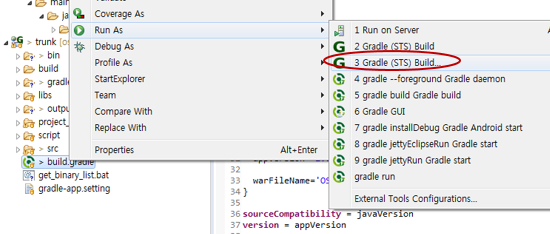
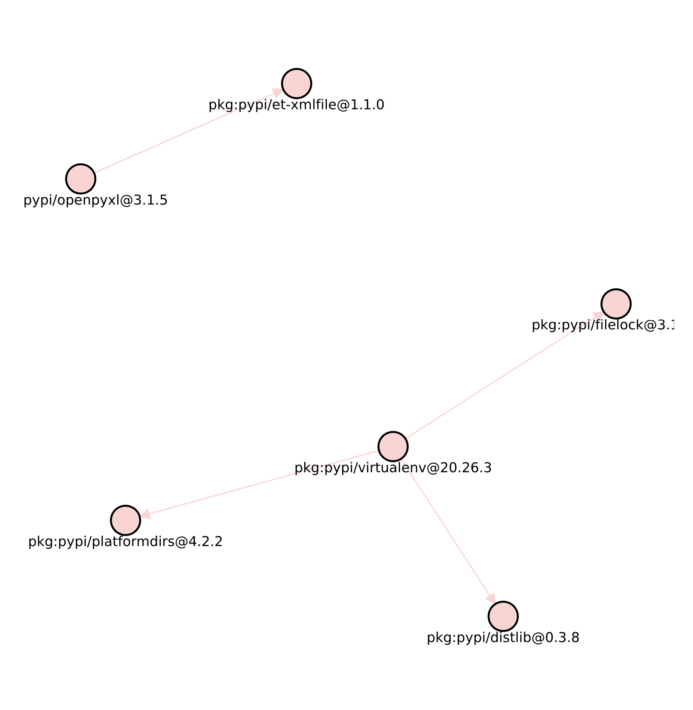

# FOSSLight Dependency Scanner

<a href="https://github.com/fosslight/fosslight_dependency_scanner/blob/main/LICENSE"></a> <a href="https://pypi.org/project/fosslight-dependency/"></a>  <a href="https://github.com/fosslight/fosslight_dependency_scanner"></a> <a href="https://api.reuse.software/info/github.com/fosslight/fosslight_dependency_scanner"></a>
    
[**FOSSLight Dependency Scanner**](https://github.com/fosslight/fosslight_dependency_scanner)는 여러 패키지 매니저에 대한 종속성 분석을 지원하는 도구입니다. 패키지 매니저의 Manifest 파일을 자동으로 감지하고 오픈 소스 도구를 사용하여 종속성을 분석합니다. 그 후 종속성의 OSS 정보가 포함된 보고서 파일을 생성합니다. 

{::options parse_block_html="true" /}
<details>
<summary markdown="span">지원하는 Package Manager</summary>
- [Gradle](https://gradle.org/) (Java/Android)
- [Maven](http://maven.apache.org/) (Java)
- [NPM](https://www.npmjs.com/) (Node.js)
- [PNPM](https://pnpm.io/) (Node.js)
- [Yarn](https://yarnpkg.com/) (Node.js)
- [PyPi](https://pip.pypa.io/) (Python)
- [Pub](https://pub.dev/) (Dart with flutter)
- [Cocoapods](https://cocoapods.org/) (Swift/Obj-C)
- [Swift](https://swift.org/package-manager/) (Swift)
- [Carthage](https://github.com/Carthage/Carthage) (Carthage)
- [Go](https://pkg.go.dev/) (Go)
- [Nuget](https://www.nuget.org/) (.NET)
- [Helm](https://helm.sh/) (Kubernetes)
- [Unity](https://unity.com/) (Unity)
- [Cargo](https://crates.io/) (Rust)
</details>
{::options parse_block_html="false" /}
<br><br>

## 설치 방법
{: .left-bar-title}  
### Bee에서 설치(LGE Only)  
{: .specific-title}
[Bee]( https://docs.bee0.lge.com/docs/dev-tools/fosslight/)에서 FOSSLight Scanner를 설치하여 사용할 수 있습니다.  

### 일반적인 설치 방법  
{: .specific-title}   
FOSSLight Scanner는 pip3를 이용하여 설치할 수 있습니다.      
[python3 virtualenv](etc/guide_virtualenv.md) 환경에서 설치할 것을 권장합니다.  

```
$ pip3 install fosslight_dependency
```
<br><br/>

## 실행 방법 및 결과 
{: .left-bar-title} 
- 프로젝트에서 사용하는 Package manager에 따라 전제 조건 및 실행 방법을 따라하시기 바랍니다.  
- Dependency 분석은 실제 개발 시 사용한 package manager와 동일한 빌드 환경이 설정되어 있어야 정상적으로 수행됩니다. (ex, npm dependency 분석 수행을 위해 npm 빌드 도구 서버 내 설치 필요)  

{::options parse_block_html="true" /}
<details>
<summary markdown="span">**[NodeJS] Npm or Yarn**</summary>
<div style="border: 1px solid #ddd; border-radius: 5px; padding: 15px; margin: 10px 0;">  

<span class="specific-title">전제 조건</span>

1. license-checker를 설치합니다.  
   ```
   $ npm install -g license-checker
   ```
   > ▲ [주의] license-checker를 전역 패키지로 설치하기 위해서는, 반드시 '-g' option을 추가해 주어야 합니다.  
   > license-checker 모듈 및 그 dependency가 결과에 포함되고, target software와 함께 배포되는 것을 방지하기 위함입니다.  
   
   ✓ sudo 권한이 없는 경우  
   전역 모듈이 설치되는 기본 path를 변경하여 이용할 수 있습니다.  
   ```
   $ npm set prefix ~/.npm
   $ PATH=~/.npm/bin:$PATH
   ```

<span class="specific-title">실행 방법</span>
1. package.json이 존재하는 디렉토리에서 다음 명령어를 실행합니다.  
   ```
   $ fosslight_dependency
   ``` 
   - node_modules 디렉토리가 이미 설치된 경우, -m 옵션을 사용하여 실행합니다.   
   - production dependency만 분석하고자 하는 경우, node_modules 디렉토리는 production 패키지만 포함되어 있어야 합니다. ($npm install \-\-production로 설치)      
   ```
   $ fosslight_dependency -m npm
   ```
 
</div>

</details>

<details>
<summary markdown="span">**[NodeJS] Pnpm**</summary>

<div style="border: 1px solid #ddd; border-radius: 5px; padding: 15px; margin: 10px 0;">  

<span class="specific-title">실행 방법</span>  

전제 조건 없이 바로 실행할 수 있습니다.  
1. package.json이 존재하는 디렉토리에서 다음 명령어를 실행합니다.  
  ```
  $ fosslight_dependency
  ```

</div>

</details>

<details>
<summary markdown="span">**[Java/Kotlin] Gradle**</summary>

<div style="border: 1px solid #ddd; border-radius: 5px; padding: 15px; margin: 10px 0;" id="prerequisite-for-gradle">

<span class="specific-title">전제 조건</span>   

1. 프로젝트 최상위 디렉토리에 위치한 build.gradle 파일에 아래와 같이 플러그인을 추가합니다.  
   - Java  
      <pre><code>
      plugins {
          id <span style="color:#FFA500;">'com.github.hierynomus.license'</span> version <span style="color:#FFA500;">'0.16.1'</span> <span style="color:#888888;">// gradle version이 6.x 이하인 경우에는 version '0.15.0'을 이용해야 합니다.</span>
      }

      downloadLicenses {
          includeProjectDependencies = true
          dependencyConfiguration = <span style="color:#FFA500;">'runtimeClasspath'</span> <span style="color:#888888;">// gradle version이 4.6 이하인 경우에는 'runtimeClasspath' 대신 'runtime'으로 추가합니다.</span>
      }
      </code></pre>  

    - Kotlin  
      <pre><code>
      plugins {
          id(<span style="color:#FFA500;">"com.github.hierynomus.license"</span>) version <span style="color:#FFA500;">"0.16.1"</span>
      }

      downloadLicenses {
          includeProjectDependencies = true
          dependencyConfiguration = <span style="color:#FFA500;">"runtimeClasspath"</span>
      }
      </code></pre>  

2. 플러그인의 'downloadLicenses' task를 실행합니다.  
  - Linux : build.gradle이 존재하는 최상위 디렉토리에서 다음과 같이 command를 입력합니다.   
    ```
    $ ./gradlew downloadLicenses
    ```    
  - Windows : 개발 환경 (eclipse) 에서 실행 방법
      1. build.gradle 파일을 오른쪽 마우스로 클릭하고 Run As > Gradle build...를 클릭합니다.    
      
      2. "Edit Configuration" 창이 열리면 "Gradle Tasks" 탭에서 'downloadLicenses'를 입력하고 Run 버튼을 클릭하여 실행합니다.  
      

3. build/reports/license 디렉토리에 dependency-license.json이 생성된 것을 확인합니다. (생성되는 디렉토리는 linux/windows 환경 동일)  
  - project.buildDir을 변경한 경우, 결과 파일은 {project.buildDir}/reports/license/dependency-license.json에 생성되며, FOSSLight Dependency Scanner 실행 시 해당 build 디렉토리를 -c 옵션으로 지정해야 합니다.  
  ```
  fosslight_dependency -c {project.buildDir}
  ```
  - build/reports/license/dependency-license.json 예시
  ```
  {
    "name": "commons-dbcp:commons-dbcp:1.4",
    "file": "commons-dbcp-1.4.jar",
    "licenses": [
    {
      "name": "The Apache Software License, Version 2.0",
      "url": "http://www.apache.org/licenses/LICENSE-2.0.txt"
    }
    ]
  },
  {
    "name": "com.amazonaws:aws-java-sdk-machinelearning:1.11.41",
    "file": "aws-java-sdk-machinelearning-1.11.41.jar",
    "licenses": [
    {
      "name": "Apache License, Version 2.0",
      "url": "https://aws.amazon.com/apache2.0"
    }
    ]
  },
  ```  

<span class="specific-title">실행 방법</span>   
1. Linux
  - build.gradle (gradle의 manifest file)이 존재하는 path에서 다음 명령어를 실행합니다.  
    ```
    $ fosslight_dependency
    ``` 
2. Windows  
  - build.gradle (gradle의 manifest file)이 존재하는 디렉토리에 fosslight_dependency.exe를 위치시킨 후, 더블 클릭하여 실행합니다.  

</div>
</details>


<details>
<summary markdown="span">**[Java] Android(Gradle)**</summary>
<div style="border: 1px solid #ddd; border-radius: 5px; padding: 15px; margin: 10px 0;">

<span class="specific-title">전제 조건</span>   

1. Android (gradle)의 경우, input directory에 gradlew 실행 파일 및 build.gradle 파일이 존재하는 경우, plugin 추가 및 실행을 FOSSLight Dependency Scanner 내부에서 자동으로 수행하므로 바로 실행 방법으로 진행하실 수 있습니다.   
2. Android 애플리케이션 프로젝트에 'app' (또는 module name) 디렉토리가 없는 경우, <a href="#prerequisite-for-gradle">Java/Kotlin Gradle 가이드</a>를 참고하여 Dependency 분석을 수행하시기 바랍니다.


<span class="specific-title">실행 방법</span>   

1. Linux
  - build.gradle (gradle의 manifest file)이 존재하는 path에서 다음 명령어를 실행합니다.  
    ```
    $ fosslight_dependency
    ``` 
    - 애플리케이션 폴더 이름이 'app'이 아닌 경우, -n 옵션으로 애플리케이션 폴더 이름을 지정해야 합니다.  
    ```
    $ fosslight_dependency -n {application_name}
    ```
2. Windows  
  - build.gradle (gradle의 manifest file)이 존재하는 디렉토리에 fosslight_dependency.exe를 위치시킨 후, 더블 클릭하여 실행합니다.  
  - 애플리케이션 폴더 이름이 'app'이 아닌 경우, 명령 프롬프트에서 -n 옵션을 사용하여 실행합니다.  
    ```
    $ fosslight_dependency.exe -n {application_name}
    ```

</div>

</details>

<details>
<summary markdown="span">**[Python] Pypi**</summary>

<div style="border: 1px solid #ddd; border-radius: 5px; padding: 15px; margin: 10px 0;">

```tip
- 시스템 내 전역으로 설치된 파이썬 dependency로부터 분석하고자 하는 프로젝트 dependency를 분리하기 위해 가상환경을 설정하여 이용하기를 권장합니다.
- 만약 input path내 requirements.txt가 존재한다면, FOSSLight Dependency Scanner가 자동으로 dependency 설치하여 분석 실행 가능하므로, 2번 단계부터는 skip합니다.
```  

<span class="specific-title">전제 조건</span>  

1. 전역 Python 패키지와 섞이지 않도록 가상환경 사용을 권장합니다.  

<span class="specific-title">실행 방법</span>  

1. 프로젝트 최상위 디렉토리(예: requirements.txt가 위치한 경로)에서 다음 명령어를 실행합니다.  
이때, 개발 과정에서 사용된 디버깅용 패키지나 전역(global) 설치 패키지가 분석 결과에 포함되지 않도록,
requirements.txt에는 배포 시 필요한 패키지만 작성되어 있어야 합니다.  
  - Linux  
    ```
    $ fosslight_dependency
    ``` 
  -  Windows 
    ```
    $ fosslight_dependency.exe
    ```
 
</div>
</details>


<details>
<summary markdown="span">**[Java] Maven**</summary>

<div style="border: 1px solid #ddd; border-radius: 5px; padding: 15px; margin: 10px 0;">  

<span class="specific-title">전제 조건</span>   

1. Maven 버전 3.5.4 이상이 필요합니다.
2. JAVA 환경이 설치되어 있어야 합니다. ([Open Source JDK 11 이상](https://openjdk.java.net) 필요)   

<span class="specific-title">실행 방법</span>   

1. Linux
  - pom.xml (Maven의 manifest file)이 존재하는 path에서 다음 명령어를 실행합니다.  
    ```
    $ fosslight_dependency
    ``` 
2. Windows  
  - pom.xml (Maven의 manifest file)이 존재하는 디렉토리에 fosslight_dependency.exe를 위치시킨 후, 더블 클릭하여 실행합니다.   
   
> **참고**: build output directory를 별도로 설정해서 사용하는 경우
>   - 설정한 {buildDir}/generated-resources 아래에 licenses.xml 파일이 생성됩니다. 이 경우, fosslight_dependency 실행 시 -o 옵션으로 해당 build output directory 를 지정해야 합니다.  
>   ```
>   $ fosslight_dependency -o customized_output_directory_name  
>   ```  

</div>

</details>

<details>
<summary markdown="span">**[Dart/flutter] Pub**</summary>

<div style="border: 1px solid #ddd; border-radius: 5px; padding: 15px; margin: 10px 0;">  

<span class="specific-title">전제 조건</span>  
1. 프로젝트 빌드 가능한 flutter가 설치되어 있어야 합니다.

<span class="specific-title">실행 방법</span>   
1. Linux/MacOS
  ```
  $ fosslight_dependency
  ```
2. Windows
  - 프로젝트 top 디렉토리에서 fosslight_dependency.exe를 더블 클릭하여 실행합니다.  
 
</div>

</details>

<details>
<summary markdown="span">**[Swift/Obj-C] CocoaPods**</summary>

<div style="border: 1px solid #ddd; border-radius: 5px; padding: 15px; margin: 10px 0;">

<span class="specific-title">전제 조건</span>

1. Pod package를 설치합니다. (MacOS)
  ```
  # 먼저 cocoapods가 설치되었는지 확인합니다.
  $ pod --version
  # 설치되어 있지 않은 경우, 다음 명령어를 실행합니다.
  $ sudo gem install cocoapods  
  # Podfile이 존재하는 project의 top directory에서, Pod package를 설치하기 위해 다음 명령어를 실행합니다.
  $ pod install
  ```

<span class="specific-title">실행 방법</span> 

1. Podfile.lock이 존재하는 디렉토리에서 하기와 같이 실행합니다.  
  ```
  $ fosslight_dependency
  ```
 
</div>

</details>

<details>
<summary markdown="span">**[Swift] Swift Package Manager**</summary>

<div style="border: 1px solid #ddd; border-radius: 5px; padding: 15px; margin: 10px 0;">  

<span class="specific-title">전제 조건</span>  

1. Github repository의 License 정보를 조회하기 위해 Personal Access Token을 생성한 뒤, FOSSLight Dependency Scanner 실행 시 -t 파라미터로 사용합니다. Token생성 방법은 [Github docs 가이드](https://docs.github.com/en/github/authenticating-to-github/keeping-your-account-and-data-secure/creating-a-personal-access-token)를 참조하시기 바랍니다.

<span class="specific-title">실행 방법</span> 

1. Package.resolved 파일이 위치한 디렉토리에서 아래 명령을 실행합니다.  
  ```
  $ fosslight_dependency -t <Github_Personal_Access_Token>  
  ```  

> **실행 Tip**  
>   - {프로젝트명}.xcodeproj 파일이 위치한 path에서 다음 명령어를 이용하여 실행할 수 있습니다.  
>   ```
>   $ fosslight_dependency -t <Github_Personal_Access_Token>
>   ```  
>     - 이 경우에는 {프로젝트명}.xcodeproj/project.xcworkspace/xcshareddata/swiftpm path에서 ‘Package.resolved' 파일을 자동으로 찾고 프로그램이 실행됩니다.  

</div>

</details>

<details>
<summary markdown="span">**[Swift/Obj-C] Carthage**</summary>

<div style="border: 1px solid #ddd; border-radius: 5px; padding: 15px; margin: 10px 0;">  

<span class="specific-title">전제 조건</span>  

1. 이미 빌드된 프로젝트로 Cartfile 디렉토리가 생성되어 있는 경우에는, carthage update 명령어('Cartfile.resolved' 파일을 생성) 실행 없이 바로 script 실행할 수 있습니다. 
  ```
  $ carthage update  
  ```  
2. Github repository의 License 정보를 조회하기 위해 Personal Access Token을 생성한 뒤, FOSSLight Dependency Scanner 실행 시 -t 파라미터로 사용합니다. Token생성 방법은 [Github docs 가이드](https://docs.github.com/en/github/authenticating-to-github/keeping-your-account-and-data-secure/creating-a-personal-access-token)를 참조하시기 바랍니다.  

<span class="specific-title">실행 방법</span>  

1. Cartfile.resolved 파일이 위치한 디렉토리에서 아래 명령을 실행합니다.  
  ```
  $ fosslight_dependency -t <Github_Personal_Access_Token>
  ```
</div>

</details>

<details>
<summary markdown="span">**[Go] Go**</summary>

<div style="border: 1px solid #ddd; border-radius: 5px; padding: 15px; margin: 10px 0;">  

<span class="specific-title">실행 방법</span>  

Go는 v1.14 이상에서 사용 가능하며, 별도의 전제 조건 없이 바로 실행할 수 있습니다.  

1. go.mod (go의 manifest file)이 파일이 위치한 디렉토리에서 아래 명령을 실행합니다.  
  ```
  fosslight_dependency 
  ```

</div>

</details>

<details>
<summary markdown="span">**[.NET] Nuget**</summary>

<div style="border: 1px solid #ddd; border-radius: 5px; padding: 15px; margin: 10px 0;">  

<span class="specific-title">실행 방법</span>  
전제 조건 없이 바로 실행할 수 있습니다. 

1. Linux/MacOS
  ```
  $ fosslight_dependency  
  ```  
2. Windows  
  ```
  $ fosslight_dependency.exe 
  ``` 

> **실행 Tip**  
> 1. CPM 프로젝트 (Central Package Management)
>  - `Directory.Packages.props` 파일이 있는 경로에서 실행해야 합니다.  
>  - `obj/project.assets.json` 파일이 없으면, 하위 경로의 `.csproj` 또는 `.sln` 파일을 찾아 자동으로 `dotnet restore`를 실행하여 `project.assets.json` 파일을 생성한 후 분석을 진행합니다.  
> 2. packages 폴더를 복사하여 reference로 사용하는 경우 (packages.config가 없는 프로젝트) 
>  - 다른 프로젝트에서 packages 폴더를 그대로 복사해 참조하고 있어 packages.config 파일이 존재하지 않는 경우, 다음 절차를 통해 packages.config를 생성한 후 FOSSLight Dependency Scanner를 실행합니다.  
>  - packages.config 생성 절차
>     1. 프로젝트를 종료합니다.  
>     2. 프로젝트 폴더 내 존재하는 packages.config가 있다면 삭제합니다.  
>     3. .csproj 파일에서 NuGet을 통해 설치되었던 라이브러리 참조 항목을 모두 제거합니다.  
>     4. 필요 시 NuGet cache 삭제 및 Solution Clean을 수행합니다.
>     5. 프로젝트를 다시 열어, 참조가 모두 제거되었는지, packages.config 파일이 없는지 확인합니다.  
>     6. 이후 다시 NuGet을 통해 패키지를 Install하면 새로운 packages.config가 생성되며 정상적으로 패키지가 설치됩니다.  

</div>

</details>

<details>
<summary markdown="span">**[Kubernetes] Helm**</summary>

<div style="border: 1px solid #ddd; border-radius: 5px; padding: 15px; margin: 10px 0;">

<span class="specific-title">실행 방법</span>  

전제 조건 없이 바로 실행할 수 있습니다.  
1. Chart.yaml 파일이 위치한 디렉토리에서 아래 명령을 실행합니다.  
  ```
  $ fosslight_dependency
  ```
> FOSSLight Dependency Scanner는 OSS 정보를 수집하기 위해 'helm dependency build' 명령어가 정상 실행되는 환경에서만 동작합니다.  
> Helm 실행 중 에러가 발생한 경우, 에러 내용을 해결한 뒤 스캐너를 다시 실행하시기 바랍니다.   

</div>

</details>

<details>
<summary markdown="span">**[Unity] Unity Package Manager**</summary>

<div style="border: 1px solid #ddd; border-radius: 5px; padding: 15px; margin: 10px 0;">  

<span class="specific-title">실행 방법</span>  

전제 조건 없이 바로 실행할 수 있습니다.  
1. Library 폴더 존재하는 디렉토리에서 아래 명령을 실행합니다.   
  ```
  $ fosslight_dependency 
  ```

</div>

</details>

<details>
<summary markdown="span">**[Rust] Cargo**</summary>

<div style="border: 1px solid #ddd; border-radius: 5px; padding: 15px; margin: 10px 0;">    

<span class="specific-title">실행 방법</span>  

전제 조건 없이 바로 실행할 수 있습니다. 
1. Cargo.toml 파일이 있는 디렉토리에서 아래 명령을 실행합니다.  
  ```
  $ fosslight_dependency
  ``` 

</div>

</details>
{::options parse_block_html="false" /}


### 실행 결과  
{: .specific-title}   

실행 path내 'fosslight_report_dep_[datetime].xlsx' 결과 파일이 생성됩니다. 
이때 -o 옵션을 이용해서 output path 변경할 수 있습니다.


### Options
{: .specific-title}
```
📖 Usage
    ────────────────────────────────────────────────────────────────────
    fosslight_dependency [options] <arguments>

    📝 Description
    ────────────────────────────────────────────────────────────────────
    FOSSLight Dependency Scanner analyzes dependencies for multiple package
    managers. It detects manifest files automatically and generates reports
    containing OSS information of dependencies.

    📚 Guide: https://fosslight.org/fosslight-guide/scanner/3_dependency.html

    📦 Supported Package Managers
    ────────────────────────────────────────────────────────────────────
    Gradle, Maven (Java)          │ NPM, PNPM, Yarn (Node.js)
    PIP (Python)                  │ Pub (Dart/Flutter)
    Cocoapods, Swift, Carthage    │ Go (Go)
    Nuget (.NET)                  │ Helm (Kubernetes)
    Unity (Unity)                 │ Cargo (Rust)

    ⚙️  General Options
    ────────────────────────────────────────────────────────────────────
    -p <path>              Path to analyze (default: current directory)
    -o <path>              Output file path or directory
    -f <format>            Output formats: excel, csv, opossum, yaml, spdx-yaml, spdx-json, spdx-xml, spdx-tag, cyclonedx-json, cyclonedx-xml
    -e <pattern>           Exclude paths from analysis (files and directories)
                           ⚠️  IMPORTANT: Always wrap in quotes to avoid shell expansion
                           Example: fosslight_dependency -e "test/" "node_modules/"
    -h                     Show this help message
    -v                     Show version information

    🔍 Scanner-Specific Options
    ────────────────────────────────────────────────────────────────────
    -m <manager>           Specify package manager (npm, maven, gradle, pypi, pub,
                           cocoapods, android, swift, carthage, go, nuget, helm,
                           unity, cargo, pnpm, yarn)
    -r                     Recursive mode: scan all subdirectories for manifest files
    --graph-path <path>    Save dependency graph image (pdf, jpg, png) (recommend pdf extension)
                           Example: fosslight_dependency --graph-path /your/path/filename.[pdf, jpg, png]
    --graph-format <format> Set graph image format (default: pdf)
    --graph-size <w> <h>   Set graph image size in pixels (requires --graph-path)
    --direct <True|False>  Print direct/transitive dependency type
                           Choose True or False (default: True)
    --notice               Print the open source license notice text

    🔧 Package Manager Specific Options
    ────────────────────────────────────────────────────────────────────
    Swift, Carthage:
      -t <token>           GitHub personal access token

    Pypi:
      -a <cmd>             Virtual environment activate command
                           (ex: 'conda activate myenv')
      -d <cmd>             Virtual environment deactivate command
                           (ex: 'conda deactivate')

    Gradle, Maven:
      -c <dir>             Customized build output directory
                           (default: 'build' for gradle, 'target' for maven)

    Android:
      -n <name>            Application directory name (default: app)

    💡 Examples
    ────────────────────────────────────────────────────────────────────
    # Scan current directory
    fosslight_dependency

    # Scan specific path with exclusions
    fosslight_dependency -p /path/to/project -e "test/" "vendor/"

    # Generate output in specific format
    fosslight_dependency -f excel -o results/

    # Specify package manager
    fosslight_dependency -m npm -p /path/to/nodejs/project

    # Recursive scan with all subdirectories
    fosslight_dependency -r

    # Generate dependency graph
    fosslight_dependency --graph-path dependency_tree.pdf

```
- -e 옵션 관련 [Pattern 매칭 가이드](https://scancode-toolkit.readthedocs.io/en/stable/cli-reference/scan-options-pre.html?highlight=ignore#glob-pattern-matching)
   - ⚠️ 사용 시 반드시 쌍 따옴표("")를 이용하여 입력하시기 바랍니다.
       - 예시) fosslight_dependency -e "dev/" "tests/"
   - ⚠️ 입력 시 파일명과 확장자는 대소문자를 정확히 구분해야 합니다.

### Tips to run  
{: .specific-title}

- FOSSLight Dependency Scanner 실행 시, 기본적으로 input path('-p' 옵션)부터 순차적으로 패키지 매니저의 manifest 파일을 감지하고, 만약 manifest 파일이 감지된다면 더 이상 하위 path에 대해 manifest 파일 감지를 중지하고, dependency 분석을 수행합니다.
(만약 전체 input path에 대해 존재하는 manifest 파일에 대해 dependency 분석 수행을 원하시는 경우, '-r' 옵션을 추가하여 실행하시기 바랍니다.)
각 패키지 매니저별 manifest 파일은 다음과 같습니다.  

  ```
    - Npm : package.json
    - Pnpm : pnpm-lock.yaml
    - Yarn : package.json
    - Pypi : requirements.txt / setup.py / pyproject.toml
    - Maven : pom.xml
    - Gradle (Android) : build.gradle
    - Pub : pubspec.yaml
    - Cocoapods : Podfile
    - Swift : Package.resolved
    - Carthage : Cartfile.resolved
    - Go : go.mod
    - Nuget : packages.config / {project name}.csproj / Directory.Packages.props
    - Helm : Chart.yaml
    - Unity : Library/PackageManager/ProjectCache
    - Cargo : Cargo.toml
  ```

- 부가 결과물 
  - fosslight_log_dep_[datetime].txt: 실행 로그가 저장된 파일
  - third_party_notice.txt : Unity로 실행한 경우에만 생성되는 파일로써, 각 패키지의 third party notice를 모아서 출력함


### Graph Network 생성 결과
{: .specific-title}
``` bash
# $ fosslight_dependency -p /project/path --graph-path ~/temp/graph.png --graph-size 1000 1000
$ cd ~/temp
$ tree
.
└── graph.png
```


- fosslight_report_dep_[datetime].xlsx 파일의 결과 중 Depends On 부분을 이용하여 각 Dependency 간의 의존 관계 그래프 이미지 저장

### 결과 파일 내용
{: .specific-title}
FOSSLight Report 결과 파일에는 transitive dependency들을 포함한 모든 분석된 dependency들의 manifest 파일을 기반으로 OSS 정보가 기록됩니다.
이때, 고유한 OSS명을 작성하기 위해, OSS명은 (패키지 매니저):(OSS명) 또는 (group id):(artifact id) 양식으로 기록됩니다.

| Package manager                | OSS Name                 | Download Location                                                                                  | Homepage                                            |
| ------------------------------ | ------------------------ | -------------------------------------------------------------------------------------------------- | --------------------------------------------------- |
| Npm, Pnpm, Yarn                | npm:(oss name)           | npmjs.com/package/(oss name)/v/(oss version)                                                       | 우선순위1. repository in package.json <br> 우선순위2. npmjs.com/package/(oss name)  |
| Pypi                           | pypi:(oss name)          | pypi.org/project/(oss name)/(version)                                                              | homepage in (pip show) information                  |
| Maven<br>& Gradle<br>& Android | (group_id):(artifact_id) | mvnrepository.com/artifact/(group id)/(artifact id)/(version)                                      | mvnrepository.com/artifact/(group id)/(artifact id) |
| Pub                            | pub:(oss name)           | pub.dev/packages/(oss name)/versions/(version)                                                     | homepage in (pub information)                       |
| Cocoapods                      | cocoapods:(oss name)     | source in (pod spec information)                                                                   | cocoapods.org/pods/(oss name)                       |
| Swift                          | swift:(oss name)         | repositoryURL in Package.resolved                                                                  | repositoryURL in Package.resolved                   |
| Carthage                       | carthage:(oss name)      | github repository in Cartfile.resolved                                                             | github repository in Cartfile.resolved              |
| Go                             | go:(oss name)            | pkg.go.dev/(oss name)@(oss version)                                                                | repository in pkg.go.dev/(oss name)@(oss version)   |
| Nuget                          | nuget:(oss name)         | 우선순위1. repository in nuget.org/packages/(oss name)/(oss version) <br> 우선순위2. projectUrl in nuget.org/packages/(oss name)/(oss version) <br> 우선순위3. nuget.org/packages/(oss name)/(oss version)  | nuget.org/packages/(oss name) |
| Helm                           | helm:(oss name)          | first url of sources in (Chart.yaml)                                                               | home in (Chart.yaml)                                |
| Unity                          | (oss name)               | url in repository in ProjectCache                                                                  | url in repository in ProjectCache                   |
| Cargo                          | cargo:(oss name)         | repository of the package in the result file for 'cargo metadata'                                  | crates.io/crates/(oss name)                        |


```warning
- Npm, Maven, gradle의 결과 파일 내용 중, Local path나 local repository를 통해 설치된(npmjs.com / mvnrepository에 배포되지 않은) 패키지의 경우, download location이 실제와 다를 수 있습니다.
- Helm은 root 프로젝트의 Chart.yaml파일에 작성된 dependencies 항목에 대해서만 출력 가능하며, 각 dependency의 dependency 항목 출력은 현재 지원하지 않고 있습니다. 또한, 'helm dependency build' 명령어 수행 후 charts/ 디렉토리 내 다운로드된 .tgz 파일 내 Chart.yaml 파일 정보에서 각 dependency의 OSS 정보를 얻어오고 있습니다.
따라서 Chart.yaml에 License 또는 Homepage와 같은 정보가 누락된 경우, 해당 정보 얻어올 수 없기에 사용자가 수기로 확인 및 보완하는 작업이 필요합니다.
```  
<br><br>


## 패키지별 지원 레벨
{: .left-bar-title} 
<table>
<thead>
  <tr>
    <th>Language/<br>Project</th>
    <th>Package Manager</th>
    <th>Manifest file</th>
    <th>Direct dependencies</th>
    <th>Transitive dependencies</th>
    <th>Relationship of dependencies<br>(Dependencies of each dependency)</th>
    <th>Internet Access<br>Required</th>
  </tr>
</thead>
<tbody>
  <tr>
    <td rowspan="3">Javascript</td>
    <td>Npm</td>
    <td>package.json</td>
    <td>O</td>
    <td>O</td>
    <td>O</td>
    <td>X</td>
  </tr>
  <tr>
    <td>Pnpm</td>
    <td>pnpm-lock.yaml</td>
    <td>O</td>
    <td>O</td>
    <td>O</td>
    <td>X</td>
  </tr>
  <tr>
    <td>Yarn</td>
    <td>package.json</td>
    <td>O</td>
    <td>O</td>
    <td>O</td>
    <td>X</td>
  </tr>
  <tr>
    <td rowspan="2">Java</td>
    <td>Gradle</td>
    <td>build.gradle</td>
    <td>O</td>
    <td>O</td>
    <td>O</td>
    <td>X</td>
  </tr>
  <tr>
    <td>Maven</td>
    <td>pom.xml</td>
    <td>O</td>
    <td>O</td>
    <td>O</td>
    <td>X</td>
  </tr>
  <tr>
    <td>Java (Android)</td>
    <td>Gradle</td>
    <td>build.gradle</td>
    <td>O</td>
    <td>O</td>
    <td>O</td>
    <td>X</td>
  </tr>
  <tr>
    <td rowspan="2">ObjC, Swift (iOS)</td>
    <td>Cocoapods</td>
    <td>Podfile.lock</td>
    <td>O</td>
    <td>O</td>
    <td>O</td>
    <td>X</td>
  </tr>
  <tr>
    <td>Carthage</td>
    <td>Cartfile.resolved</td>
    <td>O</td>
    <td>O</td>
    <td>X</td>
    <td>O</td>
  </tr>
  <tr>
    <td>Swift (iOS)</td>
    <td>Swift</td>
    <td>Package.resolved</td>
    <td>O</td>
    <td>O</td>
    <td>O</td>
    <td>O</td>
  </tr>
  <tr>
    <td>Dart, Flutter</td>
    <td>Pub</td>
    <td>pubspec.yaml</td>
    <td>O</td>
    <td>O</td>
    <td>O</td>
    <td>X</td>
  </tr>
  <tr>
    <td>Go</td>
    <td>Go</td>
    <td>go.mod</td>
    <td>O</td>
    <td>O</td>
    <td>O</td>
    <td>O</td>
  </tr>
  <tr>
    <td>Python</td>
    <td>Pypi</td>
    <td>requirements.txt,<br>setup.py,<br>pyproject.toml</td>
    <td>O</td>
    <td>O</td>
    <td>O</td>
    <td>X</td>
  </tr>
  <tr>
    <td>.NET</td>
    <td>Nuget</td>
    <td>packages.config,<br>obj/project.assets.json</td>
    <td>O</td>
    <td>O</td>
    <td>O</td>
    <td>O</td>
  </tr>
  <tr>
    <td>Kubernetes</td>
    <td>Helm</td>
    <td>Chart.yaml</td>
    <td>O</td>
    <td>X</td>
    <td>X</td>
    <td>X</td>
  </tr>
  <tr>
    <td>Unity</td>
    <td>Unity</td>
    <td>Library/PackageManager/ProjectCache</td>
    <td>O</td>
    <td>O</td>
    <td>X</td>
    <td>X</td>
  </tr>
  <tr>
    <td>Rust</td>
    <td>Cargo</td>
    <td>Cargo.toml</td>
    <td>O</td>
    <td>O</td>
    <td>O</td>
    <td>X</td>
  </tr>
</tbody>
</table>

```tip
**인터넷 접근 필요 기준**: 로컬 manifest/lock/캐시/플러그인 출력만으로 라이선스·홈페이지 등 OSS 정보를 해석할 수 없으면 인터넷 접근이 필요합니다.
```
