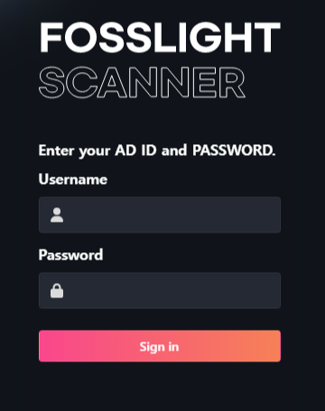
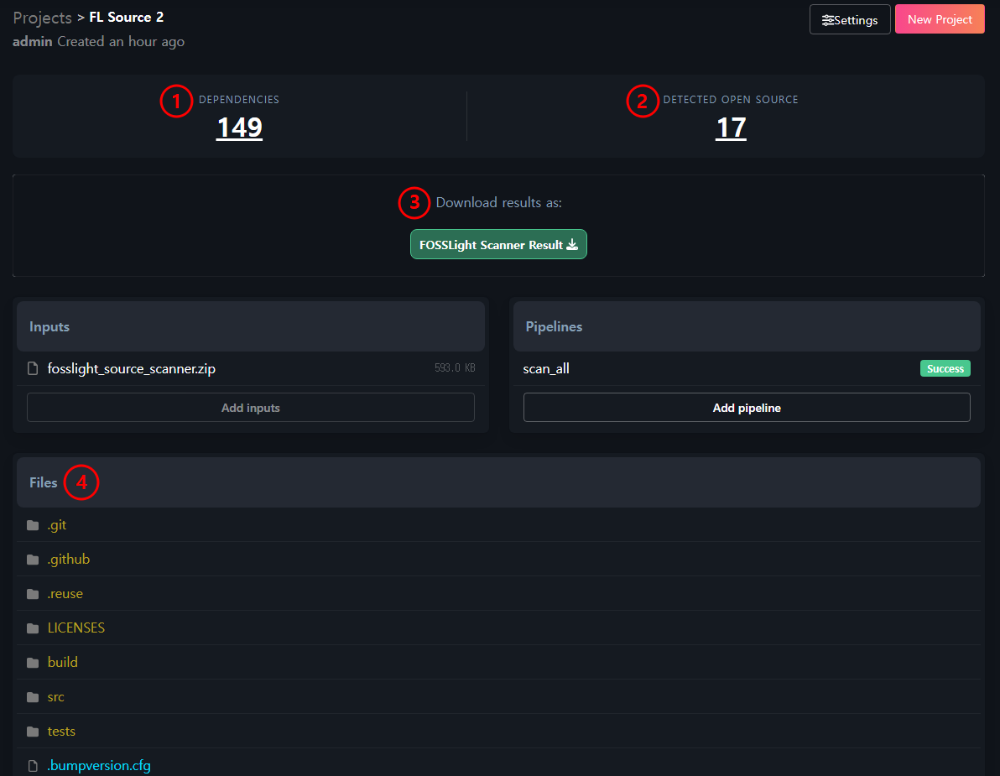

# (Enterprise Only) FOSSLight Scanner Service 

## 개요
{: .left-bar-title}
웹서비스로 [FOSSLight Scanner](https://fosslight.org/fosslight-guide/scanner/)를 이용하여 Source, Binary, Dependency 분석을 수행합니다. 분석 결과는 [FOSSLight Report](https://fosslight.org/hub-guide/learn/2_fosslight_report.html)형태로 생성됩니다.    
- URL : [http://fs.lge.com](http://fs.lge.com)
- 분석 항목 
    - [FOSSLight Source Scanner](https://fosslight.org/fosslight-guide/scanner/2_source.html)
    - [FOSSLight Binary Scanner](https://fosslight.org/fosslight-guide/scanner/4_binary.html)
    - [FOSSLight Dependency Scanner](https://fosslight.org/fosslight-guide/scanner/3_dependency.html)
        - 지원하는 package manager : npm, pypi, maven, pub, go, nuget, cargo, swift, carthage.  
          (그 외 package manager은 검증 진행 중)  
- 미지원 항목
    - [FOSSLight Android Scanner](https://fosslight.org/fosslight-guide/scanner/6_android.html)
    - [FOSSLight Yocto Scanner](https://fosslight.org/fosslight-guide/scanner/5_yocto.html)

## 사용 방법
{: .left-bar-title}

### 로그인
{: .specific-title}
- [http://fs.lge.com](http://fs.lge.com)에서 AD 계정 ID와 비밀번호를 입력하여 접속합니다. 
{: .styled-image}  

### Create a Project 
{: .specific-title} 
1. 우측 상단의 "New Project" 버튼을 클릭하여 Project를 생성합니다.  
{: .styled-image}  

2. "Create a Project"에 내용을 입력합니다.  
{: .styled-image}
    - **Name** : Project 이름을 입력합니다.
    - **Inputs** : 분석할 소스를 선택합니다.
        - **Upload files** : 분석할 파일을 압축하여 업로드합니다. (1개만 업로드)
        - **Download URLs** : 분석할 소스 링크 (wget 또는 git clone 하여 받을 수 있는 링크)를 입력합니다.
            - **Public** : 공개된 Repository인 경우 
                - 입력값 예시
                    - wget : github.com/LGE-OSS/example/archive/refs/tags/v1.0.0.zip
                    - git clone : github.com/LGE-OSS/example
            - **Private Git** : Private git 인 경우
                - **http://** 또는 **https://** : user name과 PAT 값을 입력합니다. 
                - **ssh://** : 제공되는 ssh key 값을 복사하여 private git repository에 등록합니다. ⚠️ github 는 ssh 대신 PAT 를 이용합니다.  
                {: .styled-image}  
    - **Pipeline**
        - scan_all : source, binary, dependency 분석
        - source : source code만 분석 
        - binary : binary만 분석
        - dependency : dependency만 분석
    - **권한 설정**
        - Private : 생성자만 조회 가능
        - Public : 링크를 통해 해당 Project를 다른 사람이 볼 수 있고 분석 결과를 다운로드할 수 있음 

### 분석 결과
{: .specific-title} 
{: .styled-image}
1. **Download results** : 분석 결과 파일을 다운로드 받을 수 있습니다.  
    - FOSSLight Scanner Result : FOSSLight Hub의 [Identification](https://fosslight.org/hub-guide/tutorial/1_project/2_Identification/) 과정에서 업로드 할 수 있는 리포트입니다. 
2. **Files** : 분석한 파일별 검출 결과를 File Tree 포맷으로 확인할 수 있습니다. (FOSSLight Dependency 결과는 미포함)
3. **Detected Open Source** : 분석 결과를 list로 확인할 수 있습니다.  (FOSSLight Dependency 결과는 미포함)  
{: .styled-image}  
