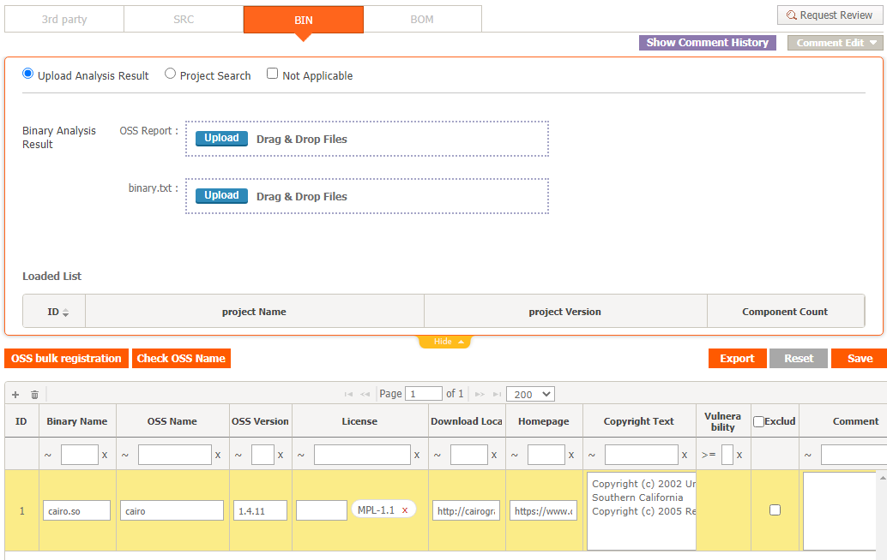

# Project Tutorial
```note
Project를 생성하고 OSC(Open Source Compliance) Process를 수행합니다.
1. Project 생성
2. Identification 작성
3. Packaging 수행
4. OSS Notice 다운로드
```

## 1. Project 생성
1-1. Project List에서 Add 버튼을 클릭합니다.  
1-2. New_Project 탭에서 Project 정보를 입력합니다.  
1-3. Project List에 Project가 생성된 것을 확인합니다.   

## 2. Identification
Project List에서 생성한 Project의 Identification Column 내 버튼을 클릭합니다. 

### 2-1. 3rd Party Tab으로 이동합니다.  
- Not Applicable을 체크하고 Save 클릭합니다.  


### 2-2. SRC Tab으로 이동합니다.  
- OSS List가 쓰여진 Sample [FOSSLight Report](result_files/FOSSLight-Report_SampleProject.xlsx)를 다운로드합니다.
- Upload 버튼을 클릭하여 다운로드받은 Sample 파일을 업로드합니다. 이때, Load 할 Sheet로 SRC Sheet를 선택합니다.   
      
- FOSSLight Report의 SRC Sheet가 Load 된 것을 확인하고 Save를 클릭합니다. 

### 2-3. BIN Tab으로 이동합니다.  
  
- OSS Table 좌측 상단 + 버튼을 클릭합니다.
- 추가된 Row에 OSS 정보를 기입합니다.
- Save 버튼을 클릭합니다.

### 2-4. BOM Tab으로 이동합니다. 
- Merge And Save 버튼을 클릭합니다.
- Request Review 버튼을 클릭하여 리뷰 요청합니다. 

### 2-5. (Admin Only) Review
- ID: admin, PSWD: admin으로 로그인합니다. 
- Project List > Status: Request인 Project의 BOM으로 이동합니다. 
- [Warning Message](../started/2_try/4_project.html#warning)를 검토합니다.
- 우측 상단의 Confirm을 클릭합니다. 

## 3. Packaging
### 3-1. Packaging Tab
- [Sample Source code](result_files/sample_src.tar.gz)를 다운로드 받습니다. 
```
$ ls sample_src
CImg-master.zip  cairo-1.4.12/
```
- Upload 버튼을 클릭하여 다운로드 받은 파일을 업로드합니다.  
- 하기와 같이 "Path of source code in the OSS Package"를 기입한 후 Save를 클릭합니다.

- Verify를 클릭하면 README, File List, Banned List 버튼이 활성화된 것을 확인할 수 있습니다.

### 3-2. Notice Tab

- "Request to generate a modified OSS Notice. "를 클릭하여 OSS Notice를 변경할 수 있습니다. 
- OSS Notice File Format을 추가적으로 체크할 수 있습니다. (발행하는 OSS Notice를 여러 형식으로 설정 가능합니다.)
- Preview 버튼을 클릭하여 OSS Notice를 미리 확인한 후 우측 하단 OK 버튼을 클릭합니다. 
- Download 버튼을 클릭하면 OSS Notice 파일을 미리 다운로드할 수 있습니다.
- Save를 클릭합니다.

### 3-3. 우측 상단 Request Review 버튼을 클릭하여 리뷰 요청합니다.
### 3-4. (Admin Only) Review 
- ID: admin, PSWD: admin으로 로그인합니다. 
- Packaging 탭 우측 상단 Review Start 버튼을 클릭합니다.
- 우측 상단 Confirm을 클릭합니다.

## 4. OSS Notice 다운로드
Project List의 Download column의 아이콘을 클릭하여 각 아이콘별 파일을 확인합니다.  
- OSS Notice 아이콘을 클릭하면 발행된 OSS Notice를 모두 다운로드받을 수 있습니다.
- ex. OSS Notice (html 형식) 일부분 :

