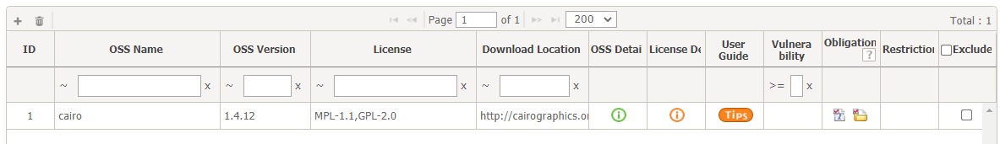

# Self-Check 생성하기
```note
Self-Check를 생성하고 OSS(Open Source Software)정보를 확인합니다.
1. Self-Check 생성
2. OSS 정보 작성
3. OSS 정보 확인
4. Export하여 파일로 다운로드
```

## 1. Self-Check  생성
1. Self-Check List에서 Add 버튼 클릭합니다.
2. Self-Check 정보를 입력합니다.  
      
3. 생성된 Self-Check를 확인합니다. 
    

## 2. OSS 정보 작성
1. Self-Check List에서 생성한 Self-Check를 더블 클릭합니다.
2. Self-Check 상세 정보탭에서 OSS 정보를 작성합니다.  
    
    1. OSS Table 좌측 상단의 + 버튼을 클릭합니다.
    2. 추가된 Row에 정보 (OSS Name, OSS Version, License)를 입력합니다.  
        - OSS Name, OSS Version를 입력하면 FOSSLight에 저장된 정보인 경우 하기 팝업이 뜹니다. 이 때, OK를 클릭하면 FOSSLight에 저장된 정보 (License, Download location)을 자동으로 불러옵니다.  
        
    3. OSS Table 좌측 상단의 + 버튼을 클릭하여 Row를 추가할 수 있습니다.
    4. Save를 클릭합니다. 
3. Check OSS Name 버튼  

작성된 Download location을 기반으로 FOSSLight에 저장된 OSS Name으로 자동 변경합니다.
- 팝업에 자동 변환될 OSS 목록이 표시됩니다. 
    - Change OSS Name 버튼 : 체크된 Row에 대하여 OSS Table의 OSS Name이 변경됩니다. 
    - Add Nickname 버튼 : 체크된 Row에 대하여 FOSSLight에 저장된 OSS에 Nickname으로 OSS Table에 쓰여진 OSS Name이 추가됩니다.

## 3. OSS 정보 확인


## 4. Export하여 파일로 다운로드

